# CorteIA — Documentación completa

_Extensión de edición automática para Adobe Premiere Pro 2026 (UXP)_

_Generado: 2026-08-19_

---

# CorteIA — Extensión de edición automática para Premiere Pro

> Panel dentro de Premiere Pro que, a partir de una carpeta de videos y un **tipo de contenido** (reel, política, deporte, ecommerce…), analiza lo más importante, calcula los cortes y entrega una **secuencia ya editada** en tu línea de tiempo.

---

## 📑 Índice de la documentación

| Documento | De qué trata |
|-----------|--------------|
| [01 · Visión y alcance](./01-vision-y-alcance.md) | Qué problema resuelve, qué hace y qué NO hace (v1) |
| [02 · Arquitectura técnica](./02-arquitectura-tecnica.md) | UXP, backend, FFmpeg, transcripción, cómo se conecta todo |
| [03 · Perfiles de video](./03-perfiles-de-video.md) | Reglas de corte por tipo de contenido (el "cerebro") |
| [04 · Flujo de usuario](./04-flujo-de-usuario.md) | Pantallas, botones y experiencia paso a paso |
| [05 · Transcripción y análisis IA](./05-transcripcion-y-analisis.md) | Modo local gratis vs API, idiomas, cómo se decide lo importante |
| [06 · Instalación (Mac y Windows)](./06-instalacion.md) | Requisitos y pasos para instalar el panel |
| [07 · Roadmap y fases](./07-roadmap.md) | En qué orden se construye, hito por hito |
| [08 · Glosario](./08-glosario.md) | Términos técnicos explicados en simple |
| [09 · Análisis visual (frame a frame)](./09-analisis-visual.md) | El "ojo" de la herramienta: mejor gancho visual, cortes limpios |
| [10 · Estructura narrativa](./10-estructura-narrativa.md) | Hook → Gancho → Cuerpo → CTA |
| [11 · Referencias técnicas](./11-referencias-tecnicas.md) | Hallazgos verificados de APIs UXP + fuentes |
| [12 · Funciones plus](./12-funciones-plus.md) | Valor agregado: subtítulos, reencuadre, multi-formato… |
| [13 · Lenguajes y stack](./13-lenguajes-y-stack.md) | Qué lenguajes se usan (HTML/CSS/JS/TS, Node, Python) |
| [14 · Guía VS Code paso a paso](./14-guia-vscode-paso-a-paso.md) | Instalar todo y ejecutar, para no-programadores |
| [15 · Cómo trabajamos juntos](./15-como-trabajamos-juntos.md) | Modelo de colaboración y tema del acceso a tu PC |

---

## 🎯 Resumen en una frase

**CorteIA** convierte material en bruto en un primer montaje ("rough cut") automático dentro de Premiere Pro, adaptando los criterios de corte al tipo de video que estás editando.

## ⚙️ Datos base del proyecto

| Dato | Valor |
|------|-------|
| **App objetivo** | Adobe Premiere Pro **26.3.2** (Premiere 2026) |
| **Tecnología del panel** | **UXP** (Unified Extensibility Platform) — estándar en Premiere 2026 |
| **Plataformas** | macOS y Windows |
| **Transcripción** | Local (gratis) **o** por API — elegible por el usuario |
| **Análisis** | Audio + texto **+ visión (frame a frame)** |
| **Estructura** | Organiza en Hook → Gancho → Cuerpo → CTA |
| **Duración final** | Elegible por el usuario (15s / 30s / 60s / personalizada / auto) |
| **Formato** | Elegible: 9:16, 16:9, 1:1, 4:5 u original (con reencuadre automático) |
| **Idiomas** | Español e Inglés (objetivo principal) · Alemán y Francés (deseables) |
| **Entrega final** | Secuencia editada en el timeline de Premiere |

## 🚦 Estado actual

- ✅ Documentación de diseño (este set)
- ⬜ Aprobación del diseño por el usuario
- ⬜ Prototipo del panel UXP (UI + botón iniciar)
- ⬜ Motor de transcripción + análisis
- ⬜ Generación de cortes en el timeline
- ⬜ Empaquetado e instalación (Mac/Win)

> Ver detalle en [07 · Roadmap y fases](./07-roadmap.md).

---

# 01 · Visión y alcance

## El problema

Editar video en bruto consume horas: hay que ver todo el material, identificar los momentos buenos, descartar silencios/errores y armar un primer montaje antes siquiera de empezar el trabajo creativo fino. Ese "primer corte" es repetitivo y mecánico.

## La solución

**CorteIA** automatiza ese primer montaje. El editor:

1. Le indica una **carpeta** con los videos.
2. Elige el **tipo de contenido** (reel, política, deporte, ecommerce, entrevista…).
3. Pulsa **Iniciar**.

La herramienta analiza el material, decide qué es lo importante **según el tipo de video**, calcula los cortes y deja una **secuencia editada lista para refinar** en el timeline de Premiere.

## Qué hace (v1)

- ✅ Lee todos los videos de una carpeta.
- ✅ Extrae el audio y lo **transcribe** (local gratis o por API).
- ✅ Detecta **silencios y pausas largas** para eliminarlos.
- ✅ Aplica un **perfil de corte** según el tipo de video elegido.
- ✅ Permite **elegir la duración** del video final (15s, 30s, 60s, personalizada o automática) y ajusta los cortes a ese objetivo.
- ✅ Permite **elegir el formato** (9:16, 16:9, 1:1, 4:5 u original) con **reencuadre automático** del sujeto.
- ✅ Usa **IA** para puntuar y seleccionar los segmentos más relevantes.
- ✅ Construye la **secuencia con los cortes** directamente en Premiere.
- ✅ Muestra **progreso** y un **resumen** de lo que hizo.

## Qué NO hace (en v1 — para no sobre-prometer)

- ❌ No hace color grading, música, transiciones creativas ni motion graphics.
- ❌ No decide el orden narrativo "perfecto"; entrega un **rough cut** que tú refinas.
- ❌ No sube nada a redes ni exporta el video final (se queda en el timeline).
- ❌ No reconoce caras/personas específicas (posible en fases futuras).

> **Principio clave:** CorteIA es un **asistente que te ahorra el 80% del trabajo mecánico**, no un reemplazo del editor. La última palabra siempre es tuya, sobre un timeline que puedes ajustar.

## Usuarios objetivo

- Editores y creadores de contenido que procesan **mucho material repetitivo**.
- Equipos de social media (reels, ecommerce) que necesitan **velocidad**.
- Periodistas / equipos políticos que arman piezas a partir de **declaraciones**.

## Criterios de éxito

| Métrica | Meta v1 |
|---------|---------|
| Tiempo de "material bruto → rough cut" | Reducirlo **≥70%** |
| Precisión de la transcripción (ES/EN) | Usable sin corrección mayor |
| Cortes útiles vs. cortes descartados por el editor | Mayoría aprovechables |
| Que el timeline abra sin errores en Premiere 26.3.2 | 100% |

## Alcance de plataformas e idiomas

- **Plataformas:** macOS y Windows (mismo código UXP, empaquetado por SO).
- **Idiomas de transcripción:**
  - **Prioridad 1:** Español e Inglés.
  - **Deseables:** Alemán y Francés (se activan si el motor los soporta con calidad suficiente; si no, quedan para una fase posterior).

---

# 02 · Arquitectura técnica

## Decisión clave: UXP (no CEP)

En **Premiere Pro 2026 (v26.x)**, Adobe convirtió **UXP** (Unified Extensibility Platform) en el estándar oficial de extensiones. La tecnología antigua **CEP** quedó **obsoleta**: ya no se carga automáticamente y solo tendrá soporte durante ~1 año más.

> **Conclusión:** el panel de CorteIA se construye en **UXP**. Empezar en CEP hoy sería empezar con tecnología muerta.

**Qué nos da UXP en Premiere 2026:**
- Paneles con **HTML + CSS + JavaScript/TypeScript**.
- Paquete oficial `@adobe/premierepro` (npm) con tipos TypeScript.
- APIs de **proyectos, secuencias, marcadores, transcripciones, import/export**.
- **Procesos externos** (poder llamar a FFmpeg / Whisper desde el panel).
- **Acceso a sistema de archivos** (leer la carpeta de videos).

## Vista general de componentes

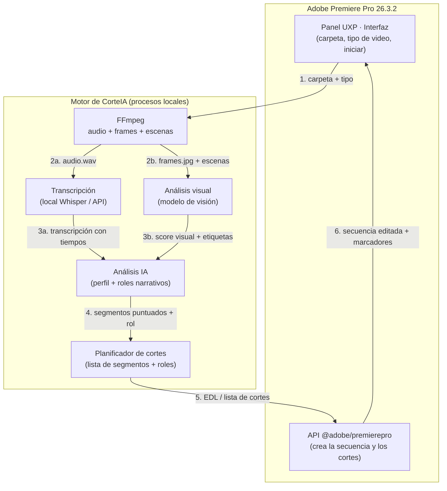

> El análisis **visual** (frame a frame) corre en paralelo al de audio y ambos se fusionan en el paso 4. Detalle en [09 · Análisis visual](./09-analisis-visual.md) y [10 · Estructura narrativa](./10-estructura-narrativa.md).

## El flujo, paso a paso

1. **Entrada** — El usuario elige carpeta + tipo de video en el panel UXP.
2. **Extracción** — FFmpeg saca el audio (WAV 16 kHz mono) y metadatos (duración, fps, resolución) de cada clip.
3. **Transcripción** — El audio se convierte en texto **con marcas de tiempo por palabra/frase**. Local (gratis) o API, según preferencia.
4. **Análisis** — Un modelo de lenguaje (LLM) recibe la transcripción + el **perfil del tipo de video** y devuelve los segmentos importantes con una **puntuación**.
5. **Planificación de cortes** — Se traduce todo a una **lista de cortes**: `clip, entrada, salida` (formato tipo EDL interno).
6. **Construcción** — Vía `@adobe/premierepro`, el panel importa los clips y **inserta cada segmento** en una secuencia nueva, en orden.
7. **Salida** — La secuencia aparece en el timeline + un **resumen** (cuántos cortes, duración final, qué se descartó).

## ¿Dónde corre el "motor"?

El análisis pesado (FFmpeg, Whisper, LLM) **no debe correr dentro del hilo de UI** de Premiere para no congelarlo. Opciones:

- **Proceso externo** lanzado por UXP (Node/binarios embebidos) que hace el trabajo y devuelve el resultado. *(Enfoque recomendado.)*
- La transcripción por API se hace con llamadas de red normales.

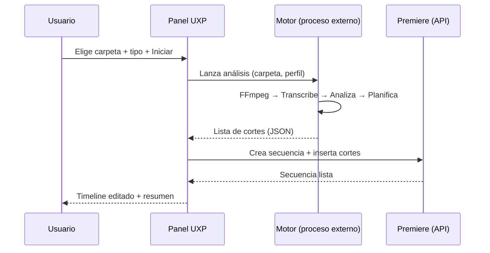

## Componentes y responsabilidades

| Componente | Tecnología | Responsabilidad |
|------------|-----------|-----------------|
| **Panel UI** | UXP (HTML/CSS/JS o TS) | Interfaz, elegir carpeta/tipo, progreso |
| **Puente con Premiere** | `@adobe/premierepro` | Importar clips, crear secuencia, insertar cortes |
| **Extractor** | FFmpeg (binario embebido) | Audio + metadatos de cada video |
| **Transcriptor** | Whisper local **o** API | Texto con marcas de tiempo |
| **Analizador** | LLM (local o API) + perfiles | Elegir y puntuar segmentos |
| **Planificador** | Lógica JS | Convertir a lista de cortes (EDL) |

## Formato interno de cortes (borrador)

```json
{
  "sequenceName": "CorteIA - Reel - 2026-08-19",
  "profile": "reel",
  "language": "es",
  "cuts": [
    { "clip": "toma01.mp4", "in": 12.4, "out": 18.9, "score": 0.92, "reason": "gancho fuerte" },
    { "clip": "toma01.mp4", "in": 45.0, "out": 51.2, "score": 0.81, "reason": "punto clave" },
    { "clip": "toma02.mp4", "in": 3.5,  "out": 9.0,  "score": 0.77, "reason": "cierre" }
  ]
}
```

Este JSON es el "contrato" entre el motor y el panel: si cambia el motor, mientras entregue este formato, el panel sigue funcionando.

## Riesgos técnicos conocidos

| Riesgo | Mitigación |
|--------|-----------|
| APIs de timeline UXP aún maduran (algunas operaciones pesadas pueden trabar la UI) | Hacer inserciones por lotes; validar en el prototipo temprano |
| No puedo **probar** contra Premiere desde este entorno | Se entrega listo + probamos juntos en tu Mac/Windows |
| Binarios FFmpeg/Whisper distintos por SO | Empaquetar binario correcto por plataforma |
| Modelos locales pesan (Whisper) | Ofrecer modelo pequeño por defecto + opción API |

---

# 03 · Perfiles de video (el "cerebro" de los cortes)

Cada **tipo de video** define **qué es lo importante** y **cómo se corta**. Esto es lo que hace que CorteIA sea útil: un reel no se edita igual que una entrevista política.

Los perfiles son **archivos de configuración editables** (JSON/YAML), así puedes ajustar el comportamiento sin tocar el código.

## Parámetros que controla cada perfil

| Parámetro | Qué hace |
|-----------|----------|
| `maxSilence` | Silencio máximo permitido antes de cortar (seg) |
| `minClip` / `maxClip` | Duración mínima/máxima de cada segmento |
| `targetDuration` | Duración objetivo del resultado final (opcional) |
| `pace` | Ritmo: `rápido`, `medio`, `pausado` |
| `keep` | Qué priorizar (ganchos, declaraciones, acción, producto…) |
| `remove` | Qué eliminar (silencios, muletillas, repeticiones, errores) |
| `scoringPrompt` | Instrucción a la IA sobre cómo puntuar la relevancia |
| `respectSentences` | Si respeta frases completas o permite cortes internos |

## Perfiles iniciales (v1)

### 🎬 Reel / Social
Cortes rápidos, engancha en los primeros segundos, elimina todo lo muerto.
```yaml
pace: rápido
maxSilence: 0.4
minClip: 1.0
maxClip: 6.0
targetDuration: 30
respectSentences: false
keep: [gancho, momento_alta_energía, remate, dato_llamativo]
remove: [silencio, muletilla, repetición, titubeo]
scoringPrompt: >
  Prioriza momentos con gancho, emoción o sorpresa. Penaliza intros lentas.
  El primer clip debe captar atención en menos de 2 segundos.
```

### 🏛️ Política / Declaraciones
Respeta frases completas, prioriza afirmaciones con peso, mantiene contexto.
```yaml
pace: pausado
maxSilence: 1.0
minClip: 3.0
maxClip: 25.0
respectSentences: true
keep: [declaración_clave, cifra, promesa, postura, respuesta_directa]
remove: [silencio_largo, muletilla, pregunta_repetida]
scoringPrompt: >
  Prioriza declaraciones claras, cifras, compromisos y respuestas directas.
  Nunca cortes una frase a la mitad ni saques algo de contexto.
```

### ⚽ Deporte
Detecta acción y picos de audio (goles, jugadas, celebraciones, narración intensa).
```yaml
pace: rápido
maxSilence: 0.6
minClip: 2.0
maxClip: 12.0
respectSentences: false
keep: [pico_de_audio, momento_de_acción, celebración, jugada_clave]
remove: [tiempo_muerto, repetición_lenta]
scoringPrompt: >
  Prioriza picos de energía en audio y narración intensa (posibles goles/jugadas).
  Usa el volumen y las palabras del narrador como señal de importancia.
```

### 🛒 Ecommerce / Producto
Muestra el producto, beneficios y llamado a la acción; ritmo ágil y limpio.
```yaml
pace: medio
maxSilence: 0.5
minClip: 1.5
maxClip: 8.0
targetDuration: 45
respectSentences: false
keep: [presentación_producto, beneficio, característica, precio, llamado_acción]
remove: [silencio, duda, información_redundante]
scoringPrompt: >
  Prioriza claridad del producto, beneficios concretos y el llamado a la acción final.
  Ordena para terminar en una invitación a comprar/actuar.
```

### 🎓 Educativo / Tutorial
Prioriza claridad y pasos ordenados; mantiene explicaciones completas, quita relleno.
```yaml
pace: medio
maxSilence: 0.7
minClip: 3.0
maxClip: 30.0
respectSentences: true
keep: [concepto_clave, paso, ejemplo, definición, conclusión]
remove: [silencio, muletilla, digresión, repetición]
scoringPrompt: >
  Prioriza explicaciones claras, pasos y ejemplos. Mantén el orden lógico
  (introducción → desarrollo → conclusión). No cortes a mitad de una idea.
```

### 📢 Anuncios / Publicidad
Mensaje directo, marca visible, beneficio y CTA potente; ritmo persuasivo.
```yaml
pace: rápido
maxSilence: 0.4
minClip: 1.0
maxClip: 8.0
targetDuration: 20
respectSentences: false
keep: [gancho, propuesta_de_valor, marca, beneficio, llamado_acción]
remove: [silencio, duda, relleno, información_secundaria]
scoringPrompt: >
  Prioriza un gancho fuerte en los primeros segundos, la propuesta de valor
  y un cierre con llamado a la acción claro. Mantén la marca visible si aparece.
```

### 🎙️ Entrevista / Podcast
Mantiene el hilo de la conversación, elimina divagaciones y silencios.
```yaml
pace: medio
maxSilence: 0.8
minClip: 4.0
maxClip: 40.0
respectSentences: true
keep: [respuesta_sustanciosa, anécdota, punto_de_vista, momento_emotivo]
remove: [silencio, muletilla, divagación, tema_irrelevante]
scoringPrompt: >
  Prioriza respuestas con contenido, historias y opiniones claras.
  Mantén el hilo lógico de la conversación.
```

## Cómo la IA usa el perfil

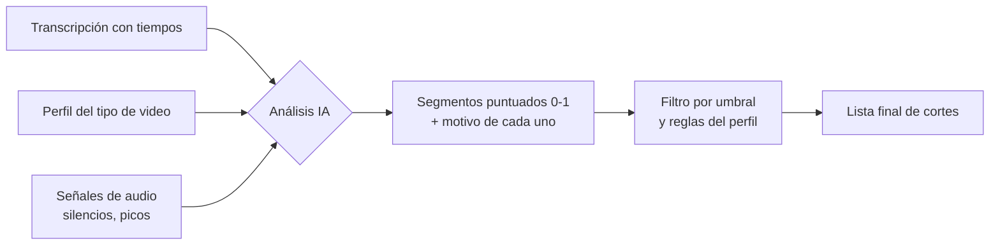

1. La IA recibe la transcripción + las **reglas del perfil** (`scoringPrompt`, `keep`, `remove`).
2. Devuelve cada segmento con un **puntaje 0–1** y un **motivo**.
3. Se aplican las reglas duras (`minClip`, `maxSilence`, `respectSentences`, `targetDuration`).
4. Se obtiene la **lista de cortes** final.

## Extensibilidad

Añadir un tipo nuevo (ej. "Educativo", "Boda", "Gaming") = crear un archivo de perfil nuevo. No requiere reprogramar el motor. El desplegable del panel se llena leyendo la carpeta de perfiles.

---

# 04 · Flujo de usuario (UX del panel)

## Dónde vive el panel

Dentro de Premiere: **Ventana → Extensiones (UXP) → CorteIA**. Se acopla como cualquier otro panel (puedes anclarlo junto a Efectos, Proyecto, etc.).

## Pantalla principal (v1)

```
┌─────────────────────────────────────────┐
│  CorteIA                            ⚙️   │
├─────────────────────────────────────────┤
│                                         │
│  📁 Carpeta de videos                   │
│  [ /Users/.../material        ] [Elegir]│
│                                         │
│  🎬 Tipo de video                       │
│  [ Reel / Social            ▼ ]         │
│                                         │
│  ⏱️ Duración del video final            │
│  [ 30 s ▼ ]   ( 15s · 30s · 60s ·       │
│                 Personalizada · Auto )  │
│                                         │
│  🖼️ Formato / relación de aspecto       │
│  [ 9:16 Vertical ▼ ]                    │
│    ( 9:16 · 16:9 · 1:1 · 4:5 · Original)│
│                                         │
│  🗣️ Idioma                              │
│  [ Español                  ▼ ]         │
│                                         │
│  🔤 Transcripción                       │
│  ( ) Local (gratis)   (•) API           │
│                                         │
│  ▸ Opciones avanzadas                   │
│                                         │
│         [  ▶  Iniciar  ]                │
│                                         │
└─────────────────────────────────────────┘
```

### ⏱️ Control de duración del video final

El usuario elige **cuánto debe durar** la secuencia resultante:

| Opción | Comportamiento |
|--------|----------------|
| **Presets** (15 s · 30 s · 60 s · 90 s) | Duración fija típica de reels/social |
| **Personalizada** | El usuario escribe el valor exacto (ej. `00:45` o `2:30`) |
| **Rango** (avanzado) | Un mínimo–máximo (ej. 25–35 s) para más flexibilidad de montaje |
| **Automática** | Sin límite fijo: usa todos los segmentos que superen el umbral de calidad |

> El valor elegido en la UI **sobrescribe** el `targetDuration` por defecto del perfil (ver [03 · Perfiles](./03-perfiles-de-video.md)).

**¿Cómo el motor cumple la duración?** El planificador tiene los segmentos ya puntuados (audio + visión) y los ajusta al objetivo:

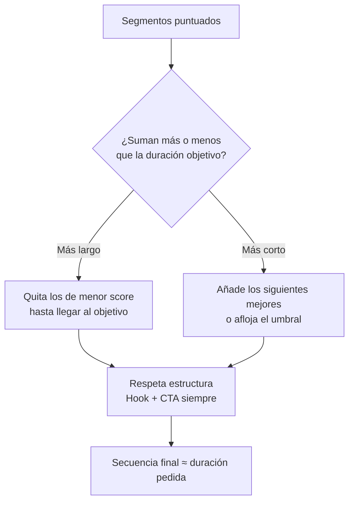

- Si el material bueno **sobra** → prioriza los segmentos de **mayor puntaje** y descarta el resto, manteniendo siempre **Hook** y **CTA**.
- Si el material bueno **falta** → añade los siguientes mejores o avisa: *"Con material de calidad solo se llega a 00:22 de los 00:30 pedidos"*.
- Respeta las reglas del perfil (`minClip`, `maxClip`) para que ningún corte quede antinatural.
- La duración final es **aproximada** (los cortes caen en límites de frase/plano), no exacta al frame — se prioriza que se vea bien.

### 🖼️ Formato / relación de aspecto

El usuario elige la forma del video final; la secuencia se crea con ese tamaño:

| Formato | Uso típico |
|---------|-----------|
| **9:16** (vertical) | Reels, TikTok, Shorts, Stories |
| **16:9** (horizontal) | YouTube, TV, web |
| **1:1** (cuadrado) | Feed de Instagram/Facebook |
| **4:5** (retrato) | Feed vertical de Instagram |
| **Original** | Mantiene el formato del material |

**Cómo se aplica:**
- La secuencia se crea directamente con el tamaño/relación elegida.
- Si el material original es de otra forma (ej. grabaste en 16:9 y quieres 9:16), se aplica **reencuadre automático** (estilo *Auto Reframe* de Premiere) para **mantener al sujeto centrado** usando las señales del análisis visual (caras/movimiento). Ver [09 · Análisis visual](./09-analisis-visual.md).
- Queda editable: puedes reajustar el encuadre de cualquier clip después.

## Estados de la interfaz

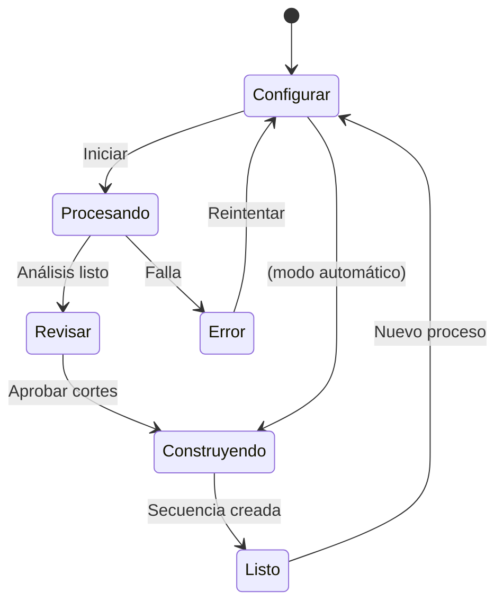

### 1. Configurar
El usuario define carpeta, tipo, idioma y modo de transcripción. Opciones avanzadas: duración objetivo, umbral de silencio, aprobar cortes antes de construir.

### 2. Procesando (con progreso real)
```
Analizando material…
[■■■■■■■□□□] 70%
✓ 3 clips leídos
✓ Audio extraído
✓ Transcripción completa (es)
⟳ Analizando importancia (perfil: Reel)…
```

### 3. Revisar (opcional, recomendado)
Antes de construir, muestra la lista de cortes propuestos para aprobar/descartar:
```
Cortes propuestos (12) · Duración final ~00:31
☑ toma01 · 00:12–00:19 · gancho fuerte      (0.92)
☑ toma01 · 00:45–00:51 · punto clave        (0.81)
☐ toma02 · 01:10–01:14 · relleno            (0.40)
...
      [ Aprobar y construir ]  [ Ajustar ]
```
> Este paso lo pediste explícitamente como opción. Se puede desactivar para un flujo 100% automático.

### 4. Construyendo
El panel crea la secuencia e inserta cada corte en el timeline de Premiere.

### 5. Listo
```
✅ Secuencia "CorteIA - Reel - 2026-08-19" creada
   12 cortes · 00:31 de duración
   Se descartaron 00:04:20 de material (silencios/relleno)
   [ Abrir en timeline ]   [ Ver resumen ]   [ Nuevo ]
```

## Opciones avanzadas (plegadas por defecto)

- **Aprobar cortes antes de construir** (on/off)
- **Duración objetivo** (para reel/ecommerce)
- **Umbral de silencio** (fino/grueso)
- **Modelo IA** (local pequeño / grande / API)
- **Carpeta de salida de audios temporales**

## Principios de UX

- **Un botón manda:** "Iniciar" siempre visible y claro.
- **Progreso honesto:** muestra qué está pasando, no una barra falsa.
- **Reversible:** todo termina en un timeline editable; nada es destructivo sobre tus archivos originales.
- **Idioma de la interfaz:** Español (con opción a Inglés más adelante).

---

# 05 · Transcripción y análisis IA

Esta es la parte que "entiende" los videos. Tiene dos etapas: **transcribir** (audio → texto con tiempos) y **analizar** (texto → segmentos importantes).

## Etapa 1 · Transcripción

El usuario elige entre dos modos:

### 🆓 Modo Local (gratis)
- Corre en la propia computadora con **Whisper** (modelo open source de OpenAI) o equivalente (ej. `faster-whisper`).
- **Ventajas:** sin costo por uso, privado (el audio no sale del equipo), funciona sin internet.
- **Contras:** más lento; los modelos grandes pesan y piden más CPU/GPU.
- **Recomendación:** modelo **pequeño/medio** por defecto para equilibrio velocidad/calidad.

### ☁️ Modo API
- Envía el audio a un servicio de transcripción (ej. OpenAI Whisper API u otro).
- **Ventajas:** rápido, alta precisión, no exige hardware potente.
- **Contras:** tiene costo por minuto y requiere **API key** + internet.

> **Nota de privacidad:** el modo API implica que el audio se procesa en un servicio externo. Para material sensible (ej. política), el modo local puede ser preferible.

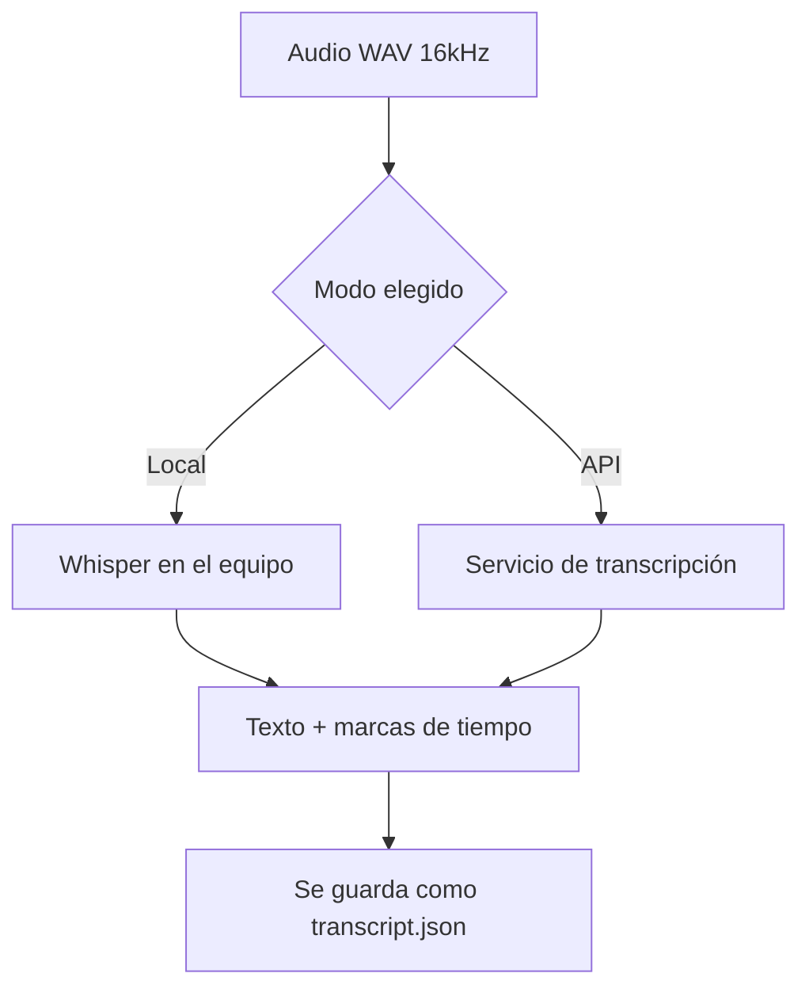

### Salida de la transcripción
Texto con **marcas de tiempo por segmento** (idealmente por palabra), que permite cortar con precisión:
```json
{
  "language": "es",
  "segments": [
    { "start": 12.40, "end": 15.10, "text": "Hoy te muestro el truco que cambió todo" },
    { "start": 15.10, "end": 16.00, "text": "eh…" },
    { "start": 16.00, "end": 18.90, "text": "y lo puedes hacer en dos minutos" }
  ]
}
```

## Idiomas soportados

| Idioma | Prioridad | Notas |
|--------|-----------|-------|
| 🇪🇸 Español | **Alta (garantizado)** | Objetivo principal |
| 🇬🇧 Inglés | **Alta (garantizado)** | Objetivo principal |
| 🇩🇪 Alemán | Media (deseable) | Whisper y APIs lo soportan; se valida calidad en pruebas |
| 🇫🇷 Francés | Media (deseable) | Igual que alemán |

> Whisper soporta ~100 idiomas, así que alemán y francés **técnicamente entran**. Se marcan como "deseables" solo para no comprometer calidad hasta validarlos con material real. Detección automática de idioma también es posible.

## Etapa 2 · Análisis IA (elegir lo importante)

Una vez hay transcripción + señales de audio (silencios, picos de volumen), un **modelo de lenguaje (LLM)** decide qué segmentos importan, guiado por el **perfil del tipo de video** (ver [03 · Perfiles](./03-perfiles-de-video.md)).

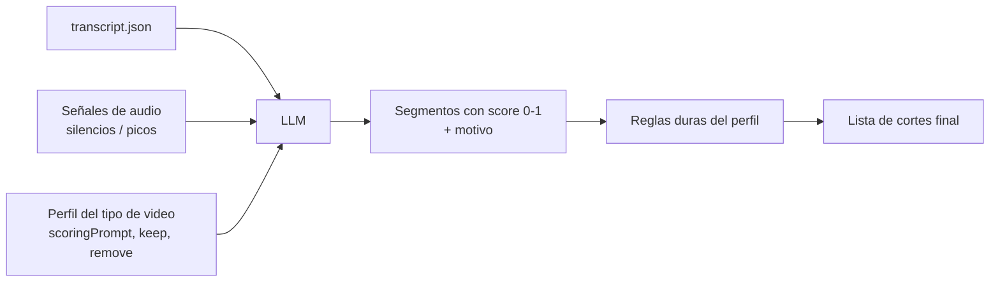

### Qué recibe el LLM (esquema del prompt)
- La transcripción con tiempos.
- El `scoringPrompt` del perfil (cómo puntuar).
- Las listas `keep` / `remove`.
- Restricciones: `minClip`, `maxClip`, `respectSentences`, `targetDuration`.

### Qué devuelve
```json
{
  "segments": [
    { "start": 12.4, "end": 18.9, "score": 0.92, "reason": "gancho fuerte, promesa clara" },
    { "start": 15.1, "end": 16.0, "score": 0.05, "reason": "muletilla 'eh', eliminar" }
  ]
}
```

### El LLM puede ser local o por API (igual que la transcripción)
- **Local:** un modelo abierto en el equipo (privado, sin costo).
- **API:** un modelo potente (mejor razonamiento, con costo/API key).

## Señales de audio (complemento sin costo)

Además del texto, el motor calcula señales baratas y útiles con FFmpeg:
- **Silencios** → candidatos a eliminar (`maxSilence` del perfil).
- **Picos de volumen (RMS)** → clave para deporte y momentos de energía.
- **Duración de pausas** → ritmo/pace.

Esto mejora los cortes incluso cuando el habla es escasa (ej. video de acción deportiva).

## Costos (referencia para el modo API)

| Componente | Local | API |
|------------|-------|-----|
| Transcripción | Gratis (usa tu CPU/GPU) | ~costo por minuto de audio |
| Análisis LLM | Gratis (modelo local) | ~costo por tokens |

> Los precios exactos de API se confirman al momento de implementar, ya que cambian. La herramienta **muestra una estimación** antes de usar el modo API.

---

# 06 · Instalación (Mac y Windows)

> Esta guía se completará cuando exista el primer paquete instalable. Aquí queda el **plan de instalación** y los requisitos, para que sepamos a dónde vamos.

## Requisitos

| Requisito | Detalle |
|-----------|---------|
| **Premiere Pro** | 26.3.2 o superior (Premiere 2026, con soporte UXP) |
| **Sistema** | macOS 13+ o Windows 10/11 (64-bit) |
| **Espacio** | ~1–3 GB si se usa transcripción local (modelos) |
| **Internet** | Solo necesario para el modo API |
| **API key** | Solo si se usa transcripción/análisis por API |

## Formato de entrega

El panel UXP se empaqueta como un archivo **`.ccx`** (Creative Cloud Extension / UXP), que se instala con **doble clic** vía el instalador de Adobe. Los binarios del motor (FFmpeg, y opcionalmente Whisper) van embebidos o se instalan en el primer arranque.

## Instalación — macOS (plan)

1. Cerrar Premiere Pro.
2. Doble clic en `CorteIA.ccx` → se instala vía Creative Cloud / UXP Developer Tool.
3. (Modo local) Ejecutar el script de preparación que instala FFmpeg + modelo Whisper en la carpeta de la app.
4. Abrir Premiere → **Ventana → Extensiones → CorteIA**.

## Instalación — Windows (plan)

1. Cerrar Premiere Pro.
2. Doble clic en `CorteIA.ccx` → se instala.
3. (Modo local) Ejecutar `setup.bat` que instala FFmpeg + modelo Whisper.
4. Abrir Premiere → **Ventana → Extensiones → CorteIA**.

## Modo desarrollador (para pruebas mientras construimos)

Durante el desarrollo se usa **UXP Developer Tool** (UDT) de Adobe para cargar el panel sin empaquetar:

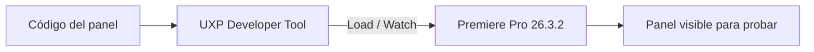

1. Instalar **UXP Developer Tool** (gratis, desde Creative Cloud).
2. "Add Plugin" → apuntar al `manifest.json` del proyecto.
3. "Load" → el panel aparece en Premiere.
4. "Watch" → recarga automática al cambiar el código.

## Configuración inicial (primer arranque)

- Elegir modo de transcripción por defecto (local / API).
- Si es API: pegar la **API key** (se guarda de forma segura, no en texto plano en el proyecto).
- (Opcional) Descargar el modelo local recomendado.

## Solución de problemas (se ampliará)

| Síntoma | Posible causa | Acción |
|---------|---------------|--------|
| El panel no aparece | Premiere < 26 o UXP no habilitado | Actualizar Premiere |
| "FFmpeg no encontrado" | Motor local no instalado | Correr script de setup |
| Transcripción muy lenta | Modelo local grande en CPU | Usar modelo pequeño o modo API |
| Error de API key | Key inválida/expirada | Regenerar y volver a pegar |

---

# 07 · Roadmap y fases

Construcción por hitos, del más básico al más completo. Cada fase entrega algo **probable** en tu Premiere.

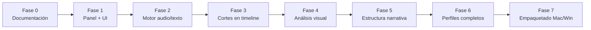

## Fase 0 — Documentación ✅ (actual)
- Visión, arquitectura, perfiles, UX, transcripción, instalación.
- **Entregable:** este set de documentos.
- **Cierre:** tu aprobación del diseño.

## Fase 1 — Panel UXP + interfaz
- Proyecto UXP base con `manifest.json` para Premiere 26.3.2.
- UI: elegir carpeta, tipo de video, idioma, modo transcripción, botón Iniciar.
- Se carga en Premiere vía UXP Developer Tool.
- **Entregable:** panel visible y navegable (aún sin procesar).
- **Cómo lo pruebas:** lo cargas en tu Premiere y ves la interfaz.

## Fase 2 — Motor de análisis
- Lectura de la carpeta + extracción de audio (FFmpeg).
- Transcripción local **y** por API (elegible).
- Análisis IA con un primer perfil.
- Genera el JSON de cortes (aún sin tocar el timeline).
- **Entregable:** de una carpeta → archivo de cortes correcto.
- **Cómo lo pruebas:** ves el JSON de cortes y la lista en el panel.

## Fase 3 — Construcción de cortes en el timeline
- Con `@adobe/premierepro`: importar clips + crear secuencia + insertar cortes.
- Paso de "Revisar cortes" (aprobar antes de construir).
- **Entregable:** de carpeta → secuencia editada en Premiere. 🎉
- **Cómo lo pruebas:** flujo completo end-to-end con material real.

## Fase 4 — Análisis visual (frame a frame)
- FFmpeg: detección de escenas + muestreo de frames.
- Modelo de visión (local/API) puntúa cada frame (cara, nitidez, texto, energía).
- Fusión de score audio + visión → cortes más limpios y mejor gancho visual.
- **Entregable:** cortes mejorados con criterio visual; elección del mejor frame de apertura.
- Detalle: [09 · Análisis visual](./09-analisis-visual.md).

## Fase 5 — Estructura narrativa (Hook → Gancho → Cuerpo → CTA)
- Clasificador de rol por segmento según el perfil.
- Montaje ordenado por estructura + marcadores de sección en el timeline.
- **Entregable:** secuencia estructurada con marcadores 🔴🟠🟢🔵.
- Detalle: [10 · Estructura narrativa](./10-estructura-narrativa.md).

## Fase 6 — Perfiles completos + señales de audio
- Todos los perfiles (reel, política, deporte, ecommerce, entrevista).
- Silencios + picos de volumen integrados al scoring.
- Pesos audio/visión por perfil + opciones avanzadas (duración objetivo, umbrales).
- **Entregable:** resultados afinados por tipo de contenido.

## Fase 7 — Empaquetado e instalación
- Empaquetar `.ccx` para macOS y Windows.
- Scripts de setup del motor local por SO.
- Guía de instalación final + solución de problemas.
- **Entregable:** instalable de doble clic en ambos sistemas.

## Mejoras futuras (post-v1, ideas)
- Reconocimiento de escenas visuales (no solo audio).
- Detección de caras / hablantes (diarización).
- Plantillas de exportación directa a redes.
- Subtítulos automáticos incrustados.
- Aprender de tus ediciones (ajustar el scoring a tu estilo).

## Nota importante sobre pruebas
Yo puedo **construir y entregar** todo el código aquí, pero **Premiere corre en tu Mac/Windows**, no en este entorno. Por eso cada fase está diseñada para que **tú la pruebes** y ajustemos con lo que veas en pantalla. Es un desarrollo **colaborativo e iterativo**.

---

# 08 · Glosario

Términos técnicos explicados en simple.

| Término | Qué significa |
|---------|---------------|
| **UXP** | *Unified Extensibility Platform.* La tecnología oficial de Adobe (desde Premiere 2026) para crear paneles/plugins con HTML, CSS y JavaScript. Reemplaza a CEP. |
| **CEP** | *Common Extensibility Platform.* La tecnología **antigua** de paneles de Adobe. Quedó obsoleta en Premiere 2026; por eso NO la usamos. |
| **Panel / Extensión** | La ventana de la herramienta dentro de Premiere (como el panel de Efectos o Proyecto). |
| **`@adobe/premierepro`** | Librería oficial de Adobe (vía npm) que permite al panel controlar Premiere: crear secuencias, importar clips, insertar cortes. |
| **`manifest.json`** | Archivo que describe el plugin UXP (nombre, permisos, dónde aparece). Es la "identidad" del panel. |
| **FFmpeg** | Herramienta libre para procesar audio/video. Aquí extrae el audio y mide silencios/volumen. |
| **Whisper** | Modelo de IA (open source, de OpenAI) que convierte voz en texto. Es la opción de transcripción **local y gratis**. |
| **Transcripción** | Convertir el audio hablado en texto, con marcas de tiempo (cuándo se dice cada cosa). |
| **LLM** | *Large Language Model.* Modelo de IA que "entiende" texto. Aquí decide qué segmentos son importantes según el tipo de video. |
| **Perfil (de video)** | Conjunto de reglas de corte para un tipo de contenido (reel, política, deporte…). Editable sin programar. |
| **Scoring / puntaje** | Nota de 0 a 1 que la IA da a cada segmento según su importancia. |
| **Segmento** | Un trozo de video entre un tiempo de inicio y uno de fin. |
| **Corte** | Un segmento que se decide **conservar** en la edición final. |
| **EDL** | *Edit Decision List.* Lista de decisiones de edición (qué clip, desde dónde, hasta dónde). Es el "plano" de la secuencia. |
| **Rough cut** | Primer montaje aproximado. Lo que entrega CorteIA para que tú lo refines. |
| **Timeline / Secuencia** | La línea de tiempo de Premiere donde se arma la edición. |
| **`.ccx`** | Formato de archivo para instalar extensiones de Adobe con doble clic. |
| **UXP Developer Tool (UDT)** | App de Adobe para cargar y probar el panel durante el desarrollo, sin empaquetarlo. |
| **API (modo de transcripción/IA)** | Usar un servicio externo por internet (más rápido/preciso, con costo y API key), en vez de correr todo local. |
| **API key** | Clave secreta que autoriza el uso de un servicio por API. |
| **Diarización** | Distinguir quién habla (hablante 1, hablante 2…). Idea para fases futuras. |
| **RMS / picos de audio** | Medida del volumen. Útil para detectar momentos de acción o energía (ej. deporte). |
| **Modelo de visión (multimodal)** | IA que "mira" imágenes y las describe/puntúa. Aquí evalúa la calidad e impacto de cada frame. |
| **Detección de escenas** | Encontrar dónde cambia el plano en un video. FFmpeg lo hace; sirve para cortar en límites naturales. |
| **`exportFramePng`** | Función de Premiere (UXP) que exporta un frame concreto a PNG. Se usa para thumbnails/previews. |
| **OCR** | *Optical Character Recognition.* Leer el texto que aparece en pantalla (rótulos, precios, CTAs). |
| **Hook visual** | El frame/plano de apertura que "frena el scroll" en los primeros segundos. |
| **CTA** | *Call To Action.* Llamado a la acción (suscríbete, compra, link abajo). |
| **FCPXML / AAF / OTIO** | Formatos de intercambio de edición. Premiere UXP puede convertirlos; posible plan B para generar el timeline. |

---

# 09 · Análisis visual (frame a frame)

Hasta ahora los cortes se decidían por **audio + texto**. Este documento añade el **ojo** de la herramienta: analizar la **imagen**, frame a frame, para elegir mejores cortes, el mejor **gancho visual** y estructurar el video.

## Por qué análisis visual

El audio dice *qué se dice*; la imagen dice *qué se ve*. Muchos aciertos de edición son puramente visuales:
- El **primer frame** que engancha (un rostro, un movimiento, un producto).
- Cortar donde hay **cambio de plano** (no a mitad de un movimiento).
- Evitar frames **borrosos, oscuros o con ojos cerrados**.
- Detectar **texto en pantalla**, **caras**, **acción/movimiento**.

## ¿Cómo se "ven" los videos? Dos caminos

### Camino A — FFmpeg + modelo de visión (recomendado, a escala)
El motor externo extrae frames y los analiza con un **modelo multimodal (visión)**.

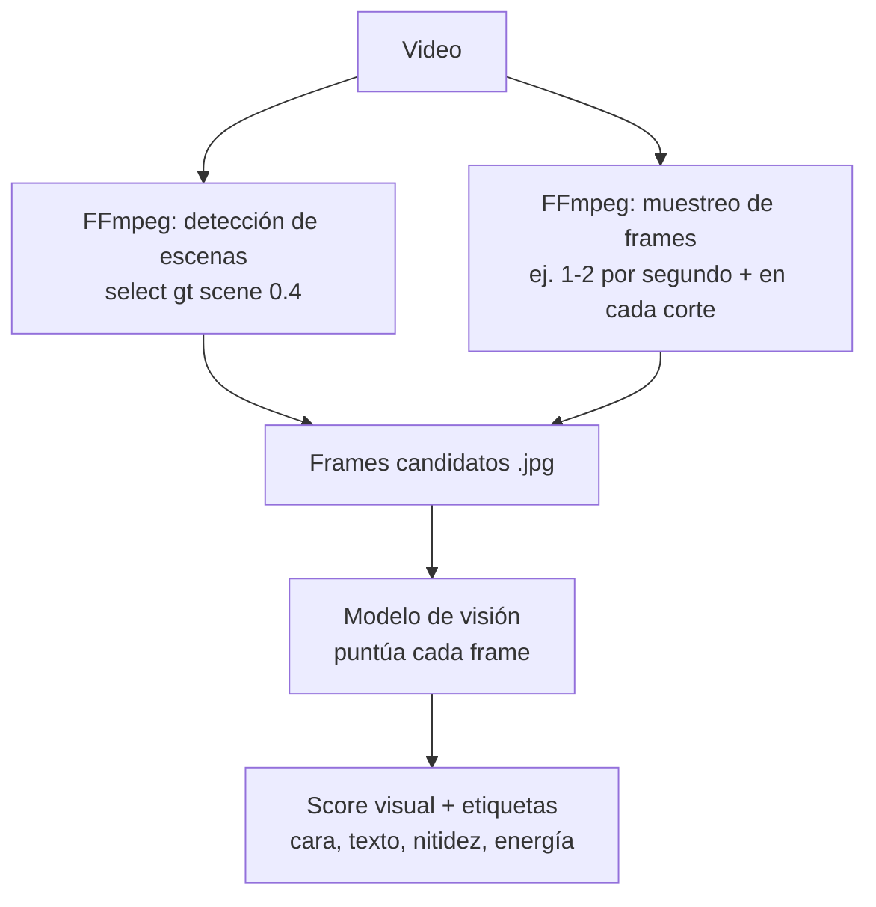

- **Detección de escenas:** FFmpeg marca dónde cambia el plano → cortes naturales.
- **Muestreo:** 1–2 frames/seg (y frames en los bordes de cada segmento candidato).
- **Visión:** cada frame recibe un **score visual** + etiquetas (cara, sonrisa, texto, nitidez, movimiento, composición). Local o por API, igual que la transcripción.

### Camino B — `exportFramePng` de Premiere (nativo, puntual)
Premiere (UXP) puede exportar un frame concreto a PNG (`exportFramePng`). Útil para **thumbnails** o para renderizar el frame exacto de un corte ya decidido, pero **no** para escanear miles de frames (sería lento). Se usa como complemento, no como motor principal.

> **Decisión:** motor principal = **FFmpeg + visión** (Camino A). `exportFramePng` = complemento para previews/thumbnails (Camino B).

## Qué mide el análisis visual (por frame o por plano)

| Señal | Para qué sirve |
|-------|----------------|
| **Nitidez / enfoque** | Descartar frames borrosos como punto de corte |
| **Brillo / exposición** | Evitar frames muy oscuros/quemados |
| **Caras y expresión** | Priorizar planos con rostro/mirada/sonrisa (enganchan) |
| **Movimiento / energía** | Detectar acción (clave en deporte/reels) |
| **Texto en pantalla (OCR)** | Reconocer rótulos, precios, CTAs visuales |
| **Composición** | Preferir encuadres limpios para hooks/portadas |
| **Cambio de plano (escena)** | Cortar en límites naturales, no a media acción |

## Cómo se combinan audio + visión

El puntaje final de cada segmento mezcla ambas señales, con pesos que dependen del **perfil del tipo de video**:

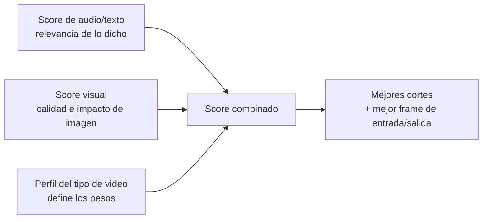

Ejemplos de peso por perfil:
- **Reel / Ecommerce:** visión pesa **alto** (lo visual vende).
- **Política / Entrevista:** audio/texto pesa **alto** (importa lo que se dice).
- **Deporte:** visión + picos de audio pesan **alto** (la acción).

## Mejora concreta de los cortes gracias a la visión

1. **Ajuste fino del punto de corte:** si el audio sugiere cortar en el segundo 12.4 pero ahí hay un frame borroso o a mitad de un gesto, la visión desplaza el corte al frame limpio más cercano (ej. 12.2 o 12.6).
2. **Elección del mejor gancho visual:** entre varios inicios posibles, elige el frame de apertura con más impacto (cara, movimiento, color, texto).
3. **Evitar planos malos:** descarta segmentos con imagen defectuosa aunque el audio sea bueno.
4. **Respetar límites de plano:** corta en cambios de escena para que no se sienta "brusco".

## Coste y rendimiento

| Enfoque | Coste | Velocidad |
|---------|-------|-----------|
| Detección de escenas (FFmpeg) | Gratis | Rápido |
| Visión local (modelo abierto) | Gratis | Depende del hardware |
| Visión por API (multimodal) | Por imagen/token | Rápido |

**Optimización:** no se analizan *todos* los frames. Se analizan (a) los **bordes de cada segmento candidato** y (b) un **muestreo** dentro de cada plano. Esto reduce el coste enormemente sin perder calidad de decisión.

> Ver cómo esto alimenta la estructura **Hook → Gancho → Cuerpo → CTA** en [10 · Estructura narrativa](./10-estructura-narrativa.md).

---

# 10 · Estructura narrativa: Hook → Gancho → Cuerpo → CTA

Además de elegir buenos cortes, CorteIA **organiza** el video en una estructura que retiene y convierte. Especialmente útil para reels, ecommerce y social.

## Las 4 partes

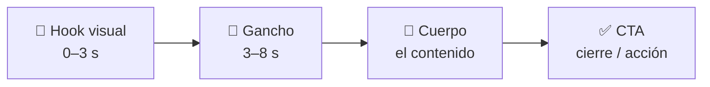

| Parte | Objetivo | Cómo la detecta CorteIA |
|-------|----------|--------------------------|
| **🎣 Hook visual** | Frenar el scroll en los primeros segundos | Mejor **frame de apertura** (visión) + primer segmento de alta energía (audio) |
| **🧲 Gancho** | Prometer valor / crear curiosidad | Frase de promesa o pregunta (texto) apoyada por imagen fuerte |
| **📖 Cuerpo** | Entregar el contenido/mensaje | Segmentos con mayor score de relevancia según el perfil |
| **✅ CTA** | Llamado a la acción / cierre | Frase de cierre o llamado ("suscríbete", "compra", "link abajo") + texto en pantalla |

> Nota: **"Hook visual"** = el impacto de imagen inicial. **"Gancho"** = la promesa verbal/conceptual que sigue. Se distinguen a propósito: uno frena el scroll, el otro convence de quedarse.

## Cómo se arma la estructura

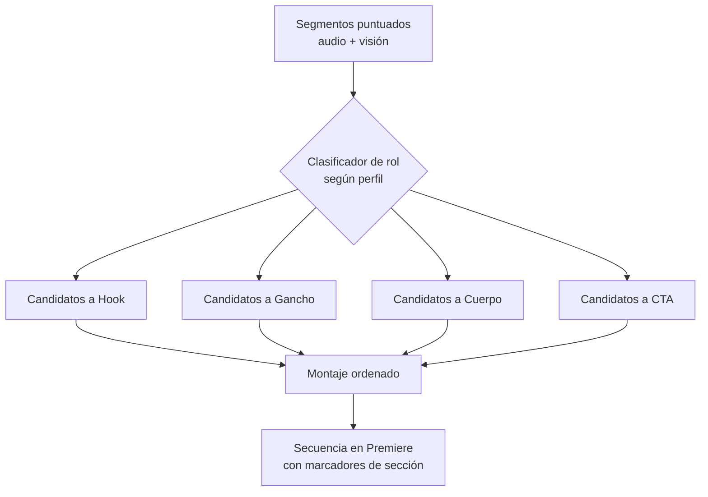

1. Cada segmento ya tiene score de **audio** y **visión**.
2. Un paso de IA **clasifica el rol** de cada segmento (hook/gancho/cuerpo/CTA) usando el `scoringPrompt` del perfil.
3. Se **selecciona el mejor** de cada rol (el hook con mejor frame de apertura, el CTA más claro, etc.).
4. Se **ordena** el montaje: hook primero, CTA al final, cuerpo en medio con ritmo del perfil.
5. En Premiere se añaden **marcadores de sección** (Hook / Gancho / Cuerpo / CTA) para que sepas qué es cada bloque y lo ajustes fácil.

## Ejemplo de salida (JSON de cortes con roles)

```json
{
  "sequenceName": "CorteIA - Reel - 2026-08-19",
  "profile": "reel",
  "structure": "hook-gancho-cuerpo-cta",
  "sections": [
    {
      "role": "hook",
      "clip": "toma01.mp4", "in": 12.2, "out": 14.0,
      "audioScore": 0.71, "visualScore": 0.94,
      "reason": "frame de apertura con rostro y movimiento; corta el scroll"
    },
    {
      "role": "gancho",
      "clip": "toma01.mp4", "in": 14.0, "out": 18.5,
      "audioScore": 0.88, "visualScore": 0.66,
      "reason": "promesa clara: 'te muestro cómo en 2 minutos'"
    },
    {
      "role": "cuerpo",
      "clip": "toma02.mp4", "in": 3.5, "out": 22.0,
      "audioScore": 0.83, "visualScore": 0.72,
      "reason": "explicación central del contenido"
    },
    {
      "role": "cta",
      "clip": "toma03.mp4", "in": 40.0, "out": 45.0,
      "audioScore": 0.79, "visualScore": 0.81,
      "reason": "llamado a la acción + texto en pantalla 'link abajo'"
    }
  ]
}
```

## Cómo cada perfil usa la estructura

| Perfil | Estructura |
|--------|-----------|
| **Reel / Social** | Estructura completa, hook agresivo, CTA obligatorio |
| **Ecommerce** | Hook (producto) → beneficios (cuerpo) → CTA de compra |
| **Deporte** | Hook = mejor jugada; cuerpo = secuencia de acción; CTA opcional |
| **Política** | Hook = declaración fuerte; cuerpo = argumento; sin CTA comercial |
| **Entrevista** | Hook = mejor frase; cuerpo = conversación; cierre reflexivo |

> Los perfiles pueden **activar o desactivar** la estructura. Un documental largo quizá no quiera CTA; un reel siempre sí.

## En el timeline

Al terminar, la secuencia trae **marcadores de color por sección**:
- 🔴 Hook · 🟠 Gancho · 🟢 Cuerpo · 🔵 CTA

Así ves de un vistazo la anatomía del video y reordenas/ajustas con un clic.

---

# 11 · Referencias técnicas (hallazgos verificados)

Notas de investigación sobre la extensibilidad de Premiere Pro 26.x, para fundamentar las decisiones de construcción. Fecha de investigación: **2026-08-19**.

## UXP es el estándar (CEP obsoleto)

- Desde **Premiere 25.6**, CEP quedó **superado por UXP**. Adobe mantiene ambos ~1 año más y luego **elimina CEP**.
- Recomendación oficial: *"If you are starting new development, start in UXP."*
- **Conclusión para CorteIA:** construir en **UXP**.

## Paquete y estructura del plugin UXP

- Paquete oficial: **`@adobe/premierepro`** (npm), con **tipos TypeScript**. Versión de referencia en samples: `^26.5.0-beta.73`.
- Estructura mínima de un plugin:
  - `manifest.json` — identidad, permisos, dónde aparece el panel.
  - `index.html` — interfaz (usa componentes Spectrum `sp-*`: `sp-button`, `sp-body`, etc.).
  - `index.js` / TypeScript — lógica.
- Flujo de desarrollo: **UXP Developer Tool** (UDT) → Add Plugin → Load → Watch (hot-reload).
- **Importante:** en UXP las llamadas a la API son **asíncronas** y **no bloquean** la UI (en CEP/ExtendScript eran síncronas y congelaban Premiere).

## APIs UXP relevantes (del sample oficial `premiere-api`)

El panel de referencia `premiere-api` ejercita:
- **Projects** y **Sequences** (crear, leer).
- **Timeline:** insertar/overwrite/append de clips; **in/out points**.
- **Markers** (marcadores — los usaremos para las secciones Hook/Gancho/Cuerpo/CTA).
- **Metadata** de clips.
- **Effects, transitions, keyframes**.
- **Source monitor**.
- **Import/Export** y **Encoder**.
- **Transcripts** (transcripciones/subtítulos — Premiere tiene STT nativo, opción extra de transcripción).
- Conversión de proyecto: **AAF, FCPXML, OTIO** (¡útil! podríamos generar FCPXML como plan B para el timeline).

## Frames / imagen

- Premiere expone **`exportFramePng`** (desde 25.3+) para exportar un frame a PNG. Bien para **thumbnails/previews**, no para escanear miles de frames.
- Para análisis visual a escala → **FFmpeg** (detección de escenas + muestreo) + **modelo de visión**. Ver [09 · Análisis visual](./09-analisis-visual.md).

## Permisos del manifest que necesitaremos

| Permiso | Para qué |
|---------|----------|
| `localFileSystem` | Leer la carpeta de videos, escribir temporales |
| `launchProcess` | Ejecutar FFmpeg / Whisper / motor local |
| `network` | Modo API (transcripción / IA / visión) |

> El sample `oauth-workflow-sample` demuestra `network` + `launchProcess` y un broker Node.js — patrón reutilizable para llamadas externas seguras.

## Sobre ukramedia (recurso de aprendizaje)

- Canal de **Sergei Prokhnevskiy** (ukramedia). Fuerte en **expresiones de After Effects** y en construir **extensiones CEP** (puente **CSInterface** + **ExtendScript**).
- Es material **era-CEP**: los conceptos (panel HTML/JS ↔ host) son válidos, pero la implementación concreta (CSInterface, ExtendScript síncrono) **no aplica a UXP**. Se usa como referencia conceptual, no como código a copiar.

## Fuentes

- UXP Premiere plugins (Adobe): https://developer.adobe.com/premiere-pro/uxp/plugins/
- Referencia de API UXP: https://developer.adobe.com/premiere-pro/uxp/ppro-reference/
- Samples UXP oficiales: https://github.com/AdobeDocs/uxp-premiere-pro-samples
- PProPanel (CEP, legacy): https://github.com/Adobe-CEP/Samples/blob/master/PProPanel/ReadMe.md
- UXP en Premiere 2026 (Hyper Brew): https://hyperbrew.co/blog/uxp-plugins-in-premiere-2026/
- Building Adobe Extensions (Hyper Brew): https://hyperbrew.co/blog/building-adobe-extensions/

---

# 12 · Funciones "plus" (valor agregado)

Más allá de lo esencial (elegir carpeta, duración, formato, tipo → cortar y organizar), estas funciones hacen a CorteIA notablemente más útil. Se priorizan por fase (ver [07 · Roadmap](./07-roadmap.md)).

## Incluidas en el plan v1

| Función | Qué aporta | Se apoya en |
|---------|-----------|-------------|
| 🖼️ **Reencuadre automático** al formato (9:16, 1:1…) | Adapta material horizontal a vertical manteniendo al sujeto centrado | Análisis visual (caras/movimiento) |
| ⏱️ **Ajuste a duración objetivo** | Entrega el video en la duración pedida priorizando lo mejor | Planificador + scoring |
| 🧩 **Estructura Hook → Gancho → Cuerpo → CTA** | Montaje que retiene y convierte | [10 · Estructura](./10-estructura-narrativa.md) |
| 🎯 **Marcadores de sección** en el timeline | Ves la anatomía del video (🔴🟠🟢🔵) y editas rápido | API de markers UXP |
| 🔇 **Eliminación de silencios/muletillas** | Quita tiempos muertos automáticamente | FFmpeg + transcripción |
| 👁️ **Mejor frame de apertura (hook visual)** | Elige el arranque que frena el scroll | Análisis visual |
| 📝 **Resumen del proceso** | Cuántos cortes, duración, qué se descartó | Reporte final |
| ✅ **Revisar antes de construir** | Apruebas/descartas cortes antes del montaje | Paso opcional en UI |

## Extras de alto valor (recomendados, fase posterior)

| Función | Qué aporta |
|---------|-----------|
| 💬 **Subtítulos automáticos** | Genera subtítulos desde la transcripción (quemados o como pista editable). Clave para social (se ve sin sonido) |
| 🔊 **Normalización de audio (loudness)** | Nivela el volumen para un sonido consistente entre clips |
| 🖼️ **Sugerencia de portada/thumbnail** | Propone el mejor frame como miniatura (`exportFramePng`) |
| 🎞️ **Multi-formato en un clic** | Genera varias secuencias (9:16 + 1:1 + 16:9) del mismo montaje |
| 💾 **Preajustes del usuario** | Guarda "mi carpeta + mi formato + mi tipo favorito" para repetir con un clic |
| 🔁 **Reordenar cortes** (drag & drop) en la revisión | Ajuste manual antes de construir |
| 🗣️ **Detección de hablantes (diarización)** | Distingue quién habla (útil en entrevistas/podcast) |
| 🎵 **Sincronía con música/beats** | Alinea cortes al ritmo de una pista (reels) |
| 🌐 **Presets de exportación por plataforma** | Ajustes listos para TikTok/YouTube/Instagram |

## Ideas exploratorias (futuro lejano)

- **Aprender tu estilo:** ajustar el scoring según qué cortes sueles conservar o descartar.
- **B-roll inteligente:** sugerir dónde insertar planos de apoyo.
- **Detección de logos/marcas** para anuncios.
- **Guiones/hooks sugeridos** por IA a partir del contenido.

## Principio para priorizar

> Primero **lo esencial** funcionando de punta a punta (carpeta → cortes → timeline), luego los "plus" que multipliquen el ahorro de tiempo sin volver la herramienta frágil. Cada extra se activa/desactiva para no saturar la interfaz.

---

# 13 · Lenguajes de programación y stack técnico

## Respuesta directa

| ¿Se usa? | Lenguaje / tecnología | Para qué |
|----------|----------------------|----------|
| ✅ **Sí** | **HTML** | Estructura de la interfaz del panel |
| ✅ **Sí** | **CSS** | Estilos del panel (componentes Spectrum `sp-*`) |
| ✅ **Sí** | **JavaScript / TypeScript** | Lógica del panel y control de Premiere (`@adobe/premierepro`) |
| ✅ **Sí** | **Node.js** (JS/TS) | Motor: orquesta FFmpeg, transcripción, IA |
| ⚙️ **Opcional** | **Python** | Solo si se usa IA **local** (Whisper, visión) |
| ⚙️ **Binario** | **FFmpeg** (C/C++, precompilado) | Extraer audio, frames, detectar escenas |
| ❌ **No** | ~~Java~~ | No aplica al ecosistema de plugins de Adobe |
| ❌ **No** | ~~PHP~~ | No aplica (no hay servidor web tradicional) |

## Por qué estos lenguajes

Los plugins de Premiere 2026 se construyen con **UXP**, que corre **tecnologías web**. Por eso el panel es **HTML + CSS + JavaScript** (igual que una página web, pero dentro de Premiere). **TypeScript** es JavaScript con tipos: lo usamos porque el paquete oficial `@adobe/premierepro` trae tipos y evita errores.

**Java** y **PHP** pertenecen a otros mundos (apps de escritorio Android/empresa y servidores web) y **no** encajan en la extensibilidad de Adobe.

## El stack por capas

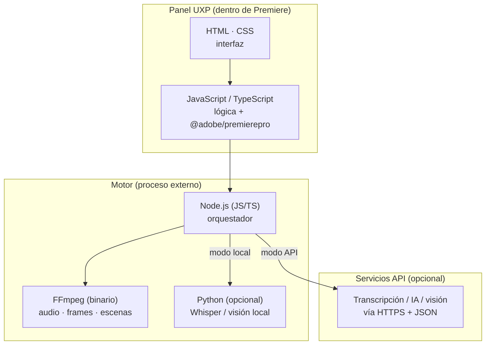

## Detalle por componente

### 1. Panel (UI) — HTML · CSS · JS/TS
- **HTML:** los campos (carpeta, duración, formato, tipo…), botones, barra de progreso.
- **CSS:** apariencia; se usan componentes **Spectrum** de Adobe (`sp-button`, `sp-dropdown`, etc.) para que se vea nativo.
- **JS/TS:** responde a los clics y llama a la API de Premiere para crear la secuencia e insertar cortes.

### 2. Puente con Premiere — `@adobe/premierepro`
- Paquete oficial (npm) en **JS/TS**. Crea secuencias, importa clips, inserta cortes, pone marcadores. Todo **asíncrono**.

### 3. Motor de análisis — Node.js (+ Python opcional)
- **Node.js** coordina todo: lanza FFmpeg, gestiona transcripción y análisis, arma el JSON de cortes.
- **FFmpeg** (binario, sin programar): extrae audio y frames, detecta escenas y silencios.
- **Python (opcional):** solo para IA **local** —`faster-whisper` (transcripción) o modelos de visión—, porque el ecosistema de IA vive en Python.
  - *Alternativa sin Python:* **whisper.cpp** (binario C++) evita instalar Python para transcripción local.

### 4. Servicios API (opcional)
- Si eliges modo API, el motor hace llamadas **HTTPS con JSON** a servicios de transcripción / IA / visión. No requiere lenguaje adicional.

## Herramientas de desarrollo

| Herramienta | Uso |
|-------------|-----|
| **UXP Developer Tool (UDT)** | Cargar y probar el panel en Premiere |
| **Node.js + npm** | Instalar dependencias y compilar TypeScript |
| **VS Code** | Editor recomendado |
| **Git** | Control de versiones del proyecto |

## Resumen en una frase

> El corazón es **JavaScript/TypeScript** (panel + motor con Node.js), con **HTML/CSS** para la interfaz y **FFmpeg**; **Python** entra solo si quieres IA local. **Nada de Java ni PHP.**

---

# 14 · Guía paso a paso con VS Code (para no-programadores)

Esta guía asume que **nunca has programado**. Cada paso está explicado en simple. No tienes que entender el código: solo instalar unas herramientas, copiar-pegar comandos y hacer clic.

> 💡 Idea clave: el **código lo escribo yo**. Tú solo preparas tu computadora y ejecutas lo que te indico. VS Code es como "Word para código": un programa donde se abre el proyecto.

## Qué vas a instalar (una sola vez)

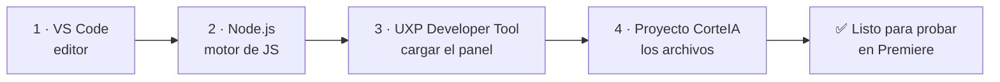

| # | Herramienta | Para qué | Dónde |
|---|-------------|----------|-------|
| 1 | **Visual Studio Code** | Abrir y ver el proyecto | code.visualstudio.com |
| 2 | **Node.js (versión LTS)** | Instalar librerías y compilar | nodejs.org |
| 3 | **UXP Developer Tool** | Meter el panel en Premiere | App de Creative Cloud → Marketplace |
| 4 | **El proyecto CorteIA** | Los archivos del plugin | Te lo entrego yo (carpeta/ZIP) |

---

## Paso 1 · Instalar Visual Studio Code

1. Entra a **code.visualstudio.com**.
2. Descarga la versión para tu sistema (**macOS** o **Windows**).
3. Instálalo como cualquier programa (siguiente → siguiente → finalizar).
4. Ábrelo una vez para confirmar que funciona.

> **¿Qué es?** Un editor de texto para código. Aquí abriremos la carpeta del proyecto.

## Paso 2 · Instalar Node.js

1. Entra a **nodejs.org**.
2. Descarga la versión **LTS** (la recomendada, botón de la izquierda).
3. Instálala (siguiente → siguiente → finalizar).
4. Para comprobar que quedó bien: abre VS Code → menú **Terminal → New Terminal** y escribe:
   ```bash
   node --version
   ```
   Si aparece algo como `v22.x.x`, ¡funciona! ✅

> **¿Qué es?** El "motor" que ejecuta JavaScript fuera del navegador. Necesario para instalar librerías y compilar el panel.

## Paso 3 · Instalar UXP Developer Tool (UDT)

1. Abre la app de **Adobe Creative Cloud** (la que usas para instalar Premiere).
2. Busca **"UXP Developer Tool"** (en Marketplace / Escritorio) e instálala. Es **gratis**.
3. Ábrela. Aquí es donde "cargaremos" el panel dentro de Premiere.

> **¿Qué es?** La herramienta oficial de Adobe para probar plugins mientras se desarrollan, sin tener que empaquetarlos.

## Paso 4 · Abrir el proyecto en VS Code

1. Descomprime el ZIP del proyecto que te entrego (ej. `CorteIA/`).
2. En VS Code: menú **File → Open Folder…** y elige la carpeta del proyecto.
3. Verás a la izquierda la lista de archivos. **No toques nada**: solo vamos a ejecutar comandos.

## Paso 5 · Instalar las librerías del proyecto

Las "librerías" son piezas de código ya hechas que el proyecto necesita (ej. `@adobe/premierepro`). Se instalan solas con **un comando**.

1. En VS Code abre **Terminal → New Terminal**.
2. Escribe exactamente:
   ```bash
   npm install
   ```
3. Pulsa Enter y **espera** (puede tardar 1–3 min). Se creará una carpeta `node_modules` con todo lo necesario.

> **¿Qué hizo `npm install`?** Leyó el archivo `package.json` (la "lista de compras" del proyecto) y descargó todas las librerías automáticamente. **No instalas nada a mano.**

## Paso 6 · Compilar el panel (si usa TypeScript)

Algunos proyectos necesitan "compilar" (traducir TypeScript a JavaScript). Si aplica, será otro comando simple:
```bash
npm run build
```
> Yo te diré si tu versión lo necesita y cuándo.

## Paso 7 · Cargar el panel en Premiere

1. Abre **Premiere Pro 26.3.2**.
2. Abre **UXP Developer Tool**.
3. Clic en **Add Plugin** → selecciona el archivo **`manifest.json`** dentro de la carpeta del proyecto.
4. Clic en **Load**. El panel **CorteIA** aparecerá en Premiere (menú **Ventana → Extensiones**).
5. (Opcional) Clic en **Watch**: cada cambio que yo haga se recarga solo.

✅ ¡Listo! Ya tienes el panel corriendo para probar.

---

## Comandos que usarás (chuleta)

| Comando | Qué hace |
|---------|----------|
| `node --version` | Comprueba que Node está instalado |
| `npm install` | Descarga las librerías del proyecto |
| `npm run build` | Compila el panel (si aplica) |
| `npm run dev` / `watch` | Modo desarrollo con recarga (si aplica) |

> **Regla de oro:** copia y pega **exactamente** lo que te doy. Si algo falla, **copia el texto rojo del error y pégamelo**: yo lo interpreto y te doy el arreglo.

## Problemas comunes

| Síntoma | Solución |
|---------|----------|
| `node no se reconoce / command not found` | Reinstala Node.js y reinicia VS Code |
| `npm install` da errores rojos | Copia el error y envíamelo; suele ser permisos o red |
| El panel no aparece en Premiere | Verifica que elegiste el `manifest.json` correcto y que Premiere es 26+ |
| "Permission denied" | En Mac, dar permisos; en Windows, ejecutar como administrador |

## Lo que NO necesitas hacer
- ❌ No necesitas escribir código.
- ❌ No necesitas entender JavaScript/TypeScript.
- ❌ No necesitas configurar nada complejo a mano.
- ✅ Solo: instalar las 3 herramientas, abrir la carpeta, correr `npm install` y cargar el panel.

> Ver el modelo de colaboración (cómo lo hacemos juntos) en [15 · Cómo trabajamos juntos](./15-como-trabajamos-juntos.md).

---

# 15 · Cómo trabajamos juntos (sin que programes)

Este documento responde a una pregunta clave: **"Yo no sé programar, ¿puedes acceder a mi PC y hacerlo todo?"**

## Respuesta honesta sobre el acceso a tu PC

**No tengo la capacidad de "tomar control remoto" de tu computadora** como lo haría un software de escritorio remoto (tipo TeamViewer/AnyDesk). No puedo mover tu mouse ni instalar cosas por mi cuenta en tu máquina.

**Pero eso no es un problema**, porque la forma de trabajar hace que **tú nunca tengas que programar**. Yo escribo el 100% del código; tú solo haces clics y copias-pegas lo que te indico.

## Cómo colaboramos en la práctica

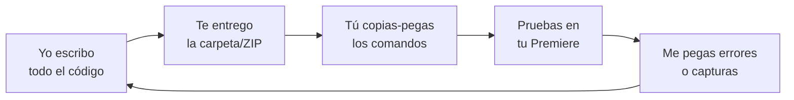

1. **Yo programo** — escribo todos los archivos del plugin (panel, motor, perfiles).
2. **Te los entrego** — como carpeta o ZIP descargable, listos.
3. **Tú los ejecutas** — sigues la [guía paso a paso](./14-guia-vscode-paso-a-paso.md): instalar 3 herramientas, `npm install`, cargar el panel.
4. **Pruebas** — abres el panel en Premiere y lo usas con material real.
5. **Me cuentas** — si algo falla, **me pegas el texto del error o una captura**; yo lo interpreto y te doy el arreglo.
6. **Repetimos** — iteramos hasta que quede perfecto.

> Tú eres mis "ojos y manos" en tu Premiere; yo soy el cerebro que programa. Con eso basta.

## ¿Hay alguna forma de que trabajes más directo en mi máquina?

Sí, dependiendo de tu configuración, hay opciones que **reducen aún más** lo que tienes que hacer:

| Opción | Qué implica |
|--------|-------------|
| **Craft Agent en tu equipo** | Si usas Craft Agent instalado en tu Mac/Windows y defines una **carpeta de trabajo** local, el agente puede **escribir los archivos directamente ahí**. Tú solo cargas el panel en Premiere. |
| **Comandos guiados** | Te doy comandos "de un solo clic" (scripts) que instalan y configuran todo automáticamente. |
| **Instaladores** | En la fase final, te entrego un archivo `.ccx` que se instala con **doble clic** (sin terminal). |
| **Sesión en vivo** | Tú compartes pantalla (por tu cuenta) y yo te guío en tiempo real, paso a paso. |

> **Importante:** aunque el agente escriba archivos, **Premiere corre en tu máquina**. La prueba final del panel siempre ocurre en tu Premiere; por eso tu rol de "probar y reportar" es esencial.

## Lo que necesito de ti (mínimo)

- ✅ Instalar 3 programas una vez (VS Code, Node.js, UXP Developer Tool).
- ✅ Copiar-pegar los comandos que te doy.
- ✅ Probar el panel en tu Premiere.
- ✅ Enviarme errores/capturas cuando algo no funcione.

## Lo que yo pongo

- ✅ Todo el código (panel + motor + perfiles).
- ✅ Las guías paso a paso.
- ✅ La interpretación de errores y los arreglos.
- ✅ Los scripts/instaladores para simplificarte la vida.

## Seguridad y confianza

- Nunca te pediré contraseñas ni control remoto de tu equipo.
- Los comandos que te dé son estándar y públicos (`npm install`, etc.); si tienes dudas, me preguntas qué hace cada uno antes de ejecutarlo.
- Tus videos y datos se quedan en **tu** computadora (salvo que elijas el modo API, donde el audio se procesa en un servicio externo — ver [05 · Transcripción](./05-transcripcion-y-analisis.md)).

## Resumen

> No puedo controlar tu PC a distancia, **pero no lo necesito**: yo hago la programación y te la entrego lista; tú solo instalas, ejecutas comandos simples y pruebas. Es un trabajo en equipo donde **no escribes ni una línea de código**.

---
