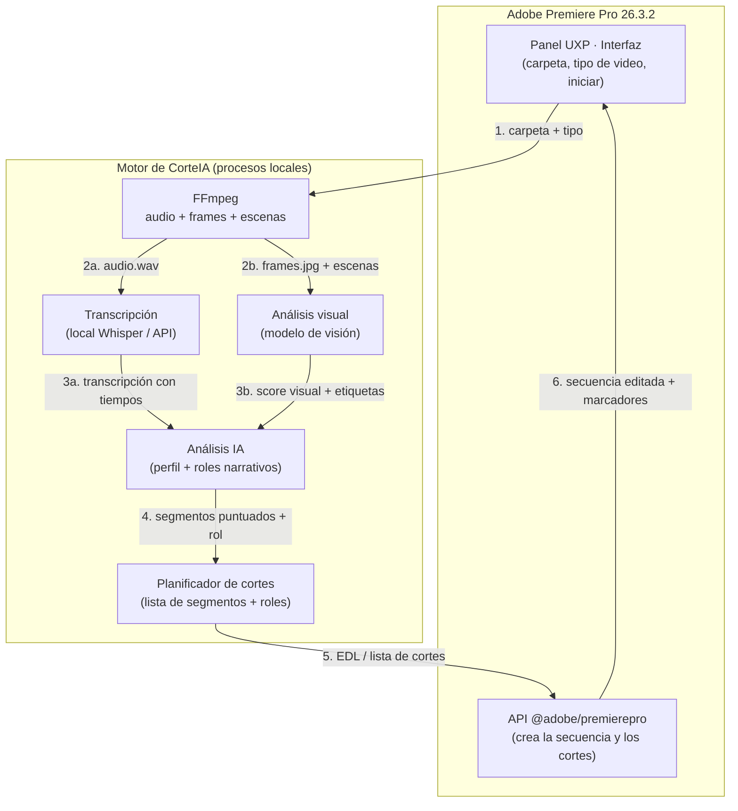
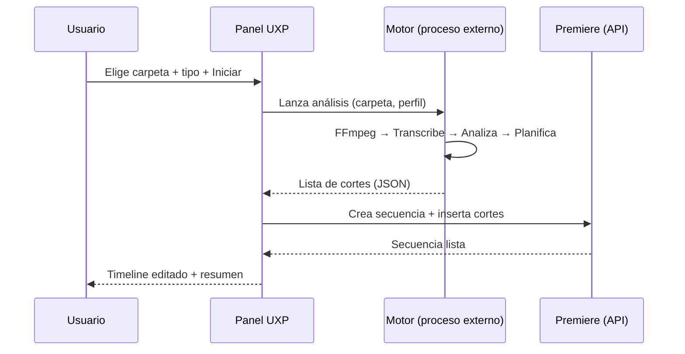

# 02 · Arquitectura técnica

## Decisión clave: UXP (no CEP)

En **Premiere Pro 2026 (v26.x)**, Adobe convirtió **UXP** (Unified Extensibility Platform) en el estándar oficial de extensiones. La tecnología antigua **CEP** quedó **obsoleta**: ya no se carga automáticamente y solo tendrá soporte durante ~1 año más.

> **Conclusión:** el panel de CorteIA se construye en **UXP**. Empezar en CEP hoy sería empezar con tecnología muerta.

**Qué nos da UXP en Premiere 2026:**
- Paneles con **HTML + CSS + JavaScript/TypeScript**.
- Paquete oficial `@adobe/premierepro` (npm) con tipos TypeScript.
- APIs de **proyectos, secuencias, marcadores, transcripciones, import/export**.
- **Procesos externos** (poder llamar a FFmpeg / Whisper desde el panel).
- **Acceso a sistema de archivos** (leer la carpeta de videos).

## Vista general de componentes



> El análisis **visual** (frame a frame) corre en paralelo al de audio y ambos se fusionan en el paso 4. Detalle en [09 · Análisis visual](./09-analisis-visual.md) y [10 · Estructura narrativa](./10-estructura-narrativa.md).

## El flujo, paso a paso

1. **Entrada** — El usuario elige carpeta + tipo de video en el panel UXP.
2. **Extracción** — FFmpeg saca el audio (WAV 16 kHz mono) y metadatos (duración, fps, resolución) de cada clip.
3. **Transcripción** — El audio se convierte en texto **con marcas de tiempo por palabra/frase**. Local (gratis) o API, según preferencia.
4. **Análisis** — Un modelo de lenguaje (LLM) recibe la transcripción + el **perfil del tipo de video** y devuelve los segmentos importantes con una **puntuación**.
5. **Planificación de cortes** — Se traduce todo a una **lista de cortes**: `clip, entrada, salida` (formato tipo EDL interno).
6. **Construcción** — Vía `@adobe/premierepro`, el panel importa los clips y **inserta cada segmento** en una secuencia nueva, en orden.
7. **Salida** — La secuencia aparece en el timeline + un **resumen** (cuántos cortes, duración final, qué se descartó).

## ¿Dónde corre el "motor"?

El análisis pesado (FFmpeg, Whisper, LLM) **no debe correr dentro del hilo de UI** de Premiere para no congelarlo. Opciones:

- **Proceso externo** lanzado por UXP (Node/binarios embebidos) que hace el trabajo y devuelve el resultado. *(Enfoque recomendado.)*
- La transcripción por API se hace con llamadas de red normales.



## Componentes y responsabilidades

| Componente | Tecnología | Responsabilidad |
|------------|-----------|-----------------|
| **Panel UI** | UXP (HTML/CSS/JS o TS) | Interfaz, elegir carpeta/tipo, progreso |
| **Puente con Premiere** | `@adobe/premierepro` | Importar clips, crear secuencia, insertar cortes |
| **Extractor** | FFmpeg (binario embebido) | Audio + metadatos de cada video |
| **Transcriptor** | Whisper local **o** API | Texto con marcas de tiempo |
| **Analizador** | LLM (local o API) + perfiles | Elegir y puntuar segmentos |
| **Planificador** | Lógica JS | Convertir a lista de cortes (EDL) |

## Formato interno de cortes (borrador)

```json
{
  "sequenceName": "CorteIA - Reel - 2026-08-19",
  "profile": "reel",
  "language": "es",
  "cuts": [
    { "clip": "toma01.mp4", "in": 12.4, "out": 18.9, "score": 0.92, "reason": "gancho fuerte" },
    { "clip": "toma01.mp4", "in": 45.0, "out": 51.2, "score": 0.81, "reason": "punto clave" },
    { "clip": "toma02.mp4", "in": 3.5,  "out": 9.0,  "score": 0.77, "reason": "cierre" }
  ]
}
```

Este JSON es el "contrato" entre el motor y el panel: si cambia el motor, mientras entregue este formato, el panel sigue funcionando.

## Riesgos técnicos conocidos

| Riesgo | Mitigación |
|--------|-----------|
| APIs de timeline UXP aún maduran (algunas operaciones pesadas pueden trabar la UI) | Hacer inserciones por lotes; validar en el prototipo temprano |
| No puedo **probar** contra Premiere desde este entorno | Se entrega listo + probamos juntos en tu Mac/Windows |
| Binarios FFmpeg/Whisper distintos por SO | Empaquetar binario correcto por plataforma |
| Modelos locales pesan (Whisper) | Ofrecer modelo pequeño por defecto + opción API |
