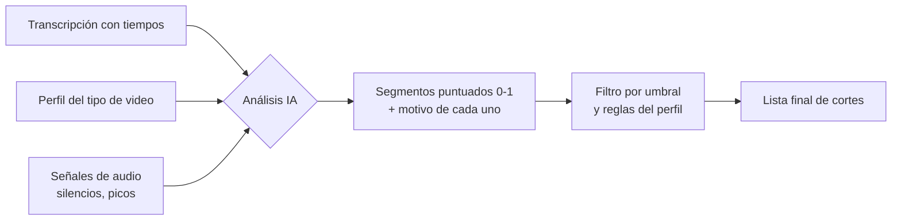

# 03 · Perfiles de video (el "cerebro" de los cortes)

Cada **tipo de video** define **qué es lo importante** y **cómo se corta**. Esto es lo que hace que CorteIA sea útil: un reel no se edita igual que una entrevista política.

Los perfiles son **archivos de configuración editables** (JSON/YAML), así puedes ajustar el comportamiento sin tocar el código.

## Parámetros que controla cada perfil

| Parámetro | Qué hace |
|-----------|----------|
| `maxSilence` | Silencio máximo permitido antes de cortar (seg) |
| `minClip` / `maxClip` | Duración mínima/máxima de cada segmento |
| `targetDuration` | Duración objetivo del resultado final (opcional) |
| `pace` | Ritmo: `rápido`, `medio`, `pausado` |
| `keep` | Qué priorizar (ganchos, declaraciones, acción, producto…) |
| `remove` | Qué eliminar (silencios, muletillas, repeticiones, errores) |
| `scoringPrompt` | Instrucción a la IA sobre cómo puntuar la relevancia |
| `respectSentences` | Si respeta frases completas o permite cortes internos |

## Perfiles iniciales (v1)

### 🎬 Reel / Social
Cortes rápidos, engancha en los primeros segundos, elimina todo lo muerto.
```yaml
pace: rápido
maxSilence: 0.4
minClip: 1.0
maxClip: 6.0
targetDuration: 30
respectSentences: false
keep: [gancho, momento_alta_energía, remate, dato_llamativo]
remove: [silencio, muletilla, repetición, titubeo]
scoringPrompt: >
  Prioriza momentos con gancho, emoción o sorpresa. Penaliza intros lentas.
  El primer clip debe captar atención en menos de 2 segundos.
```

### 🏛️ Política / Declaraciones
Respeta frases completas, prioriza afirmaciones con peso, mantiene contexto.
```yaml
pace: pausado
maxSilence: 1.0
minClip: 3.0
maxClip: 25.0
respectSentences: true
keep: [declaración_clave, cifra, promesa, postura, respuesta_directa]
remove: [silencio_largo, muletilla, pregunta_repetida]
scoringPrompt: >
  Prioriza declaraciones claras, cifras, compromisos y respuestas directas.
  Nunca cortes una frase a la mitad ni saques algo de contexto.
```

### ⚽ Deporte
Detecta acción y picos de audio (goles, jugadas, celebraciones, narración intensa).
```yaml
pace: rápido
maxSilence: 0.6
minClip: 2.0
maxClip: 12.0
respectSentences: false
keep: [pico_de_audio, momento_de_acción, celebración, jugada_clave]
remove: [tiempo_muerto, repetición_lenta]
scoringPrompt: >
  Prioriza picos de energía en audio y narración intensa (posibles goles/jugadas).
  Usa el volumen y las palabras del narrador como señal de importancia.
```

### 🛒 Ecommerce / Producto
Muestra el producto, beneficios y llamado a la acción; ritmo ágil y limpio.
```yaml
pace: medio
maxSilence: 0.5
minClip: 1.5
maxClip: 8.0
targetDuration: 45
respectSentences: false
keep: [presentación_producto, beneficio, característica, precio, llamado_acción]
remove: [silencio, duda, información_redundante]
scoringPrompt: >
  Prioriza claridad del producto, beneficios concretos y el llamado a la acción final.
  Ordena para terminar en una invitación a comprar/actuar.
```

### 🎓 Educativo / Tutorial
Prioriza claridad y pasos ordenados; mantiene explicaciones completas, quita relleno.
```yaml
pace: medio
maxSilence: 0.7
minClip: 3.0
maxClip: 30.0
respectSentences: true
keep: [concepto_clave, paso, ejemplo, definición, conclusión]
remove: [silencio, muletilla, digresión, repetición]
scoringPrompt: >
  Prioriza explicaciones claras, pasos y ejemplos. Mantén el orden lógico
  (introducción → desarrollo → conclusión). No cortes a mitad de una idea.
```

### 📢 Anuncios / Publicidad
Mensaje directo, marca visible, beneficio y CTA potente; ritmo persuasivo.
```yaml
pace: rápido
maxSilence: 0.4
minClip: 1.0
maxClip: 8.0
targetDuration: 20
respectSentences: false
keep: [gancho, propuesta_de_valor, marca, beneficio, llamado_acción]
remove: [silencio, duda, relleno, información_secundaria]
scoringPrompt: >
  Prioriza un gancho fuerte en los primeros segundos, la propuesta de valor
  y un cierre con llamado a la acción claro. Mantén la marca visible si aparece.
```

### 🎙️ Entrevista / Podcast
Mantiene el hilo de la conversación, elimina divagaciones y silencios.
```yaml
pace: medio
maxSilence: 0.8
minClip: 4.0
maxClip: 40.0
respectSentences: true
keep: [respuesta_sustanciosa, anécdota, punto_de_vista, momento_emotivo]
remove: [silencio, muletilla, divagación, tema_irrelevante]
scoringPrompt: >
  Prioriza respuestas con contenido, historias y opiniones claras.
  Mantén el hilo lógico de la conversación.
```

## Cómo la IA usa el perfil



1. La IA recibe la transcripción + las **reglas del perfil** (`scoringPrompt`, `keep`, `remove`).
2. Devuelve cada segmento con un **puntaje 0–1** y un **motivo**.
3. Se aplican las reglas duras (`minClip`, `maxSilence`, `respectSentences`, `targetDuration`).
4. Se obtiene la **lista de cortes** final.

## Extensibilidad

Añadir un tipo nuevo (ej. "Educativo", "Boda", "Gaming") = crear un archivo de perfil nuevo. No requiere reprogramar el motor. El desplegable del panel se llena leyendo la carpeta de perfiles.
