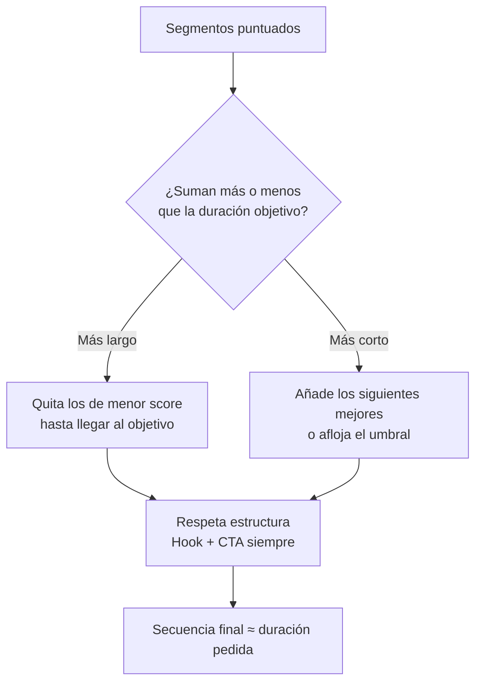
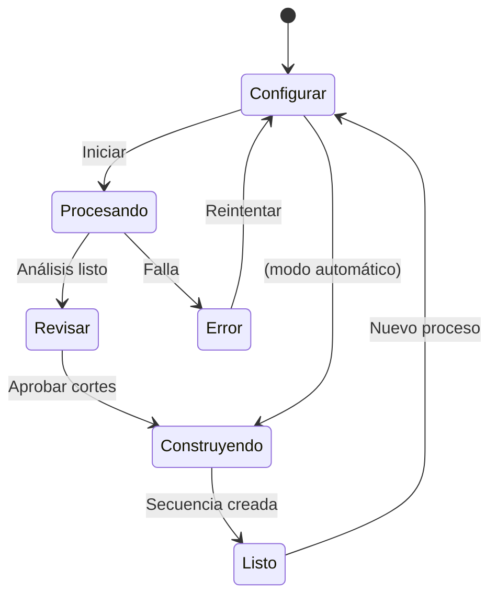

# 04 · Flujo de usuario (UX del panel)

## Dónde vive el panel

Dentro de Premiere: **Ventana → Extensiones (UXP) → CorteIA**. Se acopla como cualquier otro panel (puedes anclarlo junto a Efectos, Proyecto, etc.).

## Pantalla principal (v1)

```
┌─────────────────────────────────────────┐
│  CorteIA                            ⚙️   │
├─────────────────────────────────────────┤
│                                         │
│  📁 Carpeta de videos                   │
│  [ /Users/.../material        ] [Elegir]│
│                                         │
│  🎬 Tipo de video                       │
│  [ Reel / Social            ▼ ]         │
│                                         │
│  ⏱️ Duración del video final            │
│  [ 30 s ▼ ]   ( 15s · 30s · 60s ·       │
│                 Personalizada · Auto )  │
│                                         │
│  🖼️ Formato / relación de aspecto       │
│  [ 9:16 Vertical ▼ ]                    │
│    ( 9:16 · 16:9 · 1:1 · 4:5 · Original)│
│                                         │
│  🗣️ Idioma                              │
│  [ Español                  ▼ ]         │
│                                         │
│  🔤 Transcripción                       │
│  ( ) Local (gratis)   (•) API           │
│                                         │
│  ▸ Opciones avanzadas                   │
│                                         │
│         [  ▶  Iniciar  ]                │
│                                         │
└─────────────────────────────────────────┘
```

### ⏱️ Control de duración del video final

El usuario elige **cuánto debe durar** la secuencia resultante:

| Opción | Comportamiento |
|--------|----------------|
| **Presets** (15 s · 30 s · 60 s · 90 s) | Duración fija típica de reels/social |
| **Personalizada** | El usuario escribe el valor exacto (ej. `00:45` o `2:30`) |
| **Rango** (avanzado) | Un mínimo–máximo (ej. 25–35 s) para más flexibilidad de montaje |
| **Automática** | Sin límite fijo: usa todos los segmentos que superen el umbral de calidad |

> El valor elegido en la UI **sobrescribe** el `targetDuration` por defecto del perfil (ver [03 · Perfiles](./03-perfiles-de-video.md)).

**¿Cómo el motor cumple la duración?** El planificador tiene los segmentos ya puntuados (audio + visión) y los ajusta al objetivo:



- Si el material bueno **sobra** → prioriza los segmentos de **mayor puntaje** y descarta el resto, manteniendo siempre **Hook** y **CTA**.
- Si el material bueno **falta** → añade los siguientes mejores o avisa: *"Con material de calidad solo se llega a 00:22 de los 00:30 pedidos"*.
- Respeta las reglas del perfil (`minClip`, `maxClip`) para que ningún corte quede antinatural.
- La duración final es **aproximada** (los cortes caen en límites de frase/plano), no exacta al frame — se prioriza que se vea bien.

### 🖼️ Formato / relación de aspecto

El usuario elige la forma del video final; la secuencia se crea con ese tamaño:

| Formato | Uso típico |
|---------|-----------|
| **9:16** (vertical) | Reels, TikTok, Shorts, Stories |
| **16:9** (horizontal) | YouTube, TV, web |
| **1:1** (cuadrado) | Feed de Instagram/Facebook |
| **4:5** (retrato) | Feed vertical de Instagram |
| **Original** | Mantiene el formato del material |

**Cómo se aplica:**
- La secuencia se crea directamente con el tamaño/relación elegida.
- Si el material original es de otra forma (ej. grabaste en 16:9 y quieres 9:16), se aplica **reencuadre automático** (estilo *Auto Reframe* de Premiere) para **mantener al sujeto centrado** usando las señales del análisis visual (caras/movimiento). Ver [09 · Análisis visual](./09-analisis-visual.md).
- Queda editable: puedes reajustar el encuadre de cualquier clip después.

## Estados de la interfaz



### 1. Configurar
El usuario define carpeta, tipo, idioma y modo de transcripción. Opciones avanzadas: duración objetivo, umbral de silencio, aprobar cortes antes de construir.

### 2. Procesando (con progreso real)
```
Analizando material…
[■■■■■■■□□□] 70%
✓ 3 clips leídos
✓ Audio extraído
✓ Transcripción completa (es)
⟳ Analizando importancia (perfil: Reel)…
```

### 3. Revisar (opcional, recomendado)
Antes de construir, muestra la lista de cortes propuestos para aprobar/descartar:
```
Cortes propuestos (12) · Duración final ~00:31
☑ toma01 · 00:12–00:19 · gancho fuerte      (0.92)
☑ toma01 · 00:45–00:51 · punto clave        (0.81)
☐ toma02 · 01:10–01:14 · relleno            (0.40)
...
      [ Aprobar y construir ]  [ Ajustar ]
```
> Este paso lo pediste explícitamente como opción. Se puede desactivar para un flujo 100% automático.

### 4. Construyendo
El panel crea la secuencia e inserta cada corte en el timeline de Premiere.

### 5. Listo
```
✅ Secuencia "CorteIA - Reel - 2026-08-19" creada
   12 cortes · 00:31 de duración
   Se descartaron 00:04:20 de material (silencios/relleno)
   [ Abrir en timeline ]   [ Ver resumen ]   [ Nuevo ]
```

## Opciones avanzadas (plegadas por defecto)

- **Aprobar cortes antes de construir** (on/off)
- **Duración objetivo** (para reel/ecommerce)
- **Umbral de silencio** (fino/grueso)
- **Modelo IA** (local pequeño / grande / API)
- **Carpeta de salida de audios temporales**

## Principios de UX

- **Un botón manda:** "Iniciar" siempre visible y claro.
- **Progreso honesto:** muestra qué está pasando, no una barra falsa.
- **Reversible:** todo termina en un timeline editable; nada es destructivo sobre tus archivos originales.
- **Idioma de la interfaz:** Español (con opción a Inglés más adelante).
