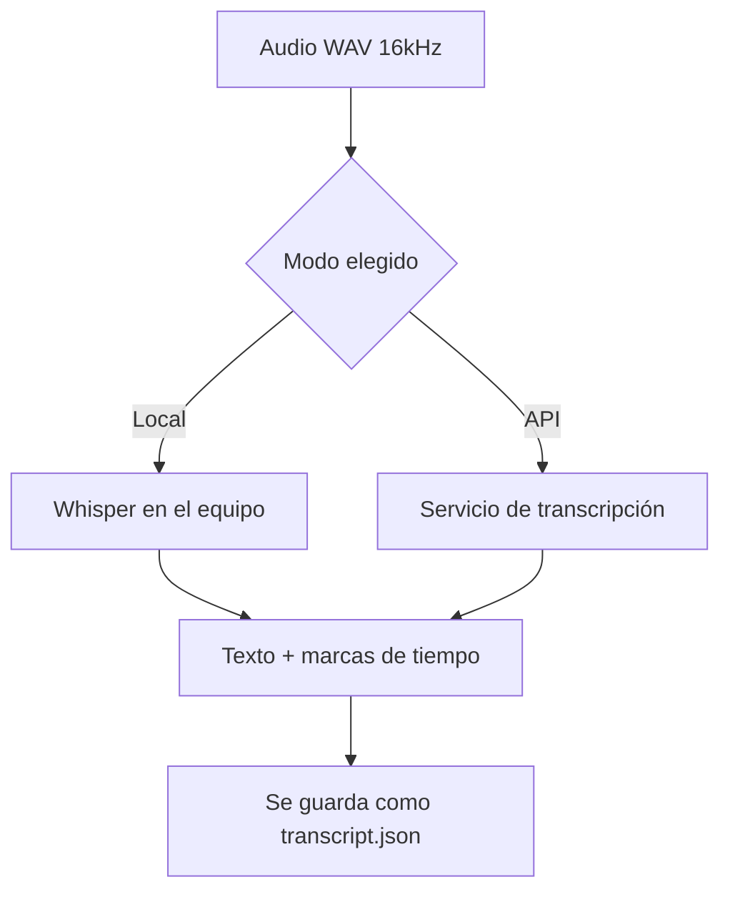
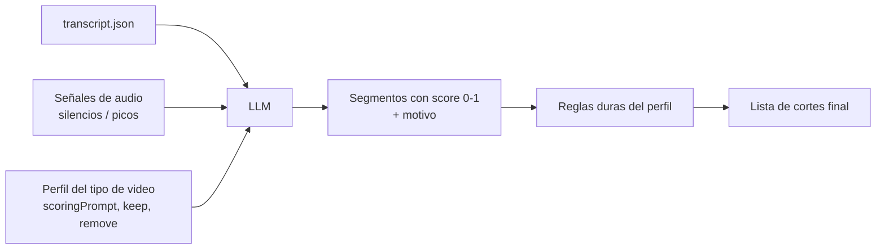

# 05 · Transcripción y análisis IA

Esta es la parte que "entiende" los videos. Tiene dos etapas: **transcribir** (audio → texto con tiempos) y **analizar** (texto → segmentos importantes).

## Etapa 1 · Transcripción

El usuario elige entre dos modos:

### 🆓 Modo Local (gratis)
- Corre en la propia computadora con **Whisper** (modelo open source de OpenAI) o equivalente (ej. `faster-whisper`).
- **Ventajas:** sin costo por uso, privado (el audio no sale del equipo), funciona sin internet.
- **Contras:** más lento; los modelos grandes pesan y piden más CPU/GPU.
- **Recomendación:** modelo **pequeño/medio** por defecto para equilibrio velocidad/calidad.

### ☁️ Modo API
- Envía el audio a un servicio de transcripción (ej. OpenAI Whisper API u otro).
- **Ventajas:** rápido, alta precisión, no exige hardware potente.
- **Contras:** tiene costo por minuto y requiere **API key** + internet.

> **Nota de privacidad:** el modo API implica que el audio se procesa en un servicio externo. Para material sensible (ej. política), el modo local puede ser preferible.



### Salida de la transcripción
Texto con **marcas de tiempo por segmento** (idealmente por palabra), que permite cortar con precisión:
```json
{
  "language": "es",
  "segments": [
    { "start": 12.40, "end": 15.10, "text": "Hoy te muestro el truco que cambió todo" },
    { "start": 15.10, "end": 16.00, "text": "eh…" },
    { "start": 16.00, "end": 18.90, "text": "y lo puedes hacer en dos minutos" }
  ]
}
```

## Idiomas soportados

| Idioma | Prioridad | Notas |
|--------|-----------|-------|
| 🇪🇸 Español | **Alta (garantizado)** | Objetivo principal |
| 🇬🇧 Inglés | **Alta (garantizado)** | Objetivo principal |
| 🇩🇪 Alemán | Media (deseable) | Whisper y APIs lo soportan; se valida calidad en pruebas |
| 🇫🇷 Francés | Media (deseable) | Igual que alemán |

> Whisper soporta ~100 idiomas, así que alemán y francés **técnicamente entran**. Se marcan como "deseables" solo para no comprometer calidad hasta validarlos con material real. Detección automática de idioma también es posible.

## Etapa 2 · Análisis IA (elegir lo importante)

Una vez hay transcripción + señales de audio (silencios, picos de volumen), un **modelo de lenguaje (LLM)** decide qué segmentos importan, guiado por el **perfil del tipo de video** (ver [03 · Perfiles](./03-perfiles-de-video.md)).



### Qué recibe el LLM (esquema del prompt)
- La transcripción con tiempos.
- El `scoringPrompt` del perfil (cómo puntuar).
- Las listas `keep` / `remove`.
- Restricciones: `minClip`, `maxClip`, `respectSentences`, `targetDuration`.

### Qué devuelve
```json
{
  "segments": [
    { "start": 12.4, "end": 18.9, "score": 0.92, "reason": "gancho fuerte, promesa clara" },
    { "start": 15.1, "end": 16.0, "score": 0.05, "reason": "muletilla 'eh', eliminar" }
  ]
}
```

### El LLM puede ser local o por API (igual que la transcripción)
- **Local:** un modelo abierto en el equipo (privado, sin costo).
- **API:** un modelo potente (mejor razonamiento, con costo/API key).

## Señales de audio (complemento sin costo)

Además del texto, el motor calcula señales baratas y útiles con FFmpeg:
- **Silencios** → candidatos a eliminar (`maxSilence` del perfil).
- **Picos de volumen (RMS)** → clave para deporte y momentos de energía.
- **Duración de pausas** → ritmo/pace.

Esto mejora los cortes incluso cuando el habla es escasa (ej. video de acción deportiva).

## Costos (referencia para el modo API)

| Componente | Local | API |
|------------|-------|-----|
| Transcripción | Gratis (usa tu CPU/GPU) | ~costo por minuto de audio |
| Análisis LLM | Gratis (modelo local) | ~costo por tokens |

> Los precios exactos de API se confirman al momento de implementar, ya que cambian. La herramienta **muestra una estimación** antes de usar el modo API.
