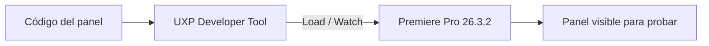

# 06 · Instalación (Mac y Windows)

> Esta guía se completará cuando exista el primer paquete instalable. Aquí queda el **plan de instalación** y los requisitos, para que sepamos a dónde vamos.

## Requisitos

| Requisito | Detalle |
|-----------|---------|
| **Premiere Pro** | 26.3.2 o superior (Premiere 2026, con soporte UXP) |
| **Sistema** | macOS 13+ o Windows 10/11 (64-bit) |
| **Espacio** | ~1–3 GB si se usa transcripción local (modelos) |
| **Internet** | Solo necesario para el modo API |
| **API key** | Solo si se usa transcripción/análisis por API |

## Formato de entrega

El panel UXP se empaqueta como un archivo **`.ccx`** (Creative Cloud Extension / UXP), que se instala con **doble clic** vía el instalador de Adobe. Los binarios del motor (FFmpeg, y opcionalmente Whisper) van embebidos o se instalan en el primer arranque.

## Instalación — macOS (plan)

1. Cerrar Premiere Pro.
2. Doble clic en `CorteIA.ccx` → se instala vía Creative Cloud / UXP Developer Tool.
3. (Modo local) Ejecutar el script de preparación que instala FFmpeg + modelo Whisper en la carpeta de la app.
4. Abrir Premiere → **Ventana → Extensiones → CorteIA**.

## Instalación — Windows (plan)

1. Cerrar Premiere Pro.
2. Doble clic en `CorteIA.ccx` → se instala.
3. (Modo local) Ejecutar `setup.bat` que instala FFmpeg + modelo Whisper.
4. Abrir Premiere → **Ventana → Extensiones → CorteIA**.

## Modo desarrollador (para pruebas mientras construimos)

Durante el desarrollo se usa **UXP Developer Tool** (UDT) de Adobe para cargar el panel sin empaquetar:

1. Instalar **UXP Developer Tool** (gratis, desde Creative Cloud).
2. "Add Plugin" → apuntar al `manifest.json` del proyecto.
3. "Load" → el panel aparece en Premiere.
4. "Watch" → recarga automática al cambiar el código.

## Configuración inicial (primer arranque)

- Elegir modo de transcripción por defecto (local / API).
- Si es API: pegar la **API key** (se guarda de forma segura, no en texto plano en el proyecto).
- (Opcional) Descargar el modelo local recomendado.

## Solución de problemas (se ampliará)

| Síntoma | Posible causa | Acción |
|---------|---------------|--------|
| El panel no aparece | Premiere < 26 o UXP no habilitado | Actualizar Premiere |
| "FFmpeg no encontrado" | Motor local no instalado | Correr script de setup |
| Transcripción muy lenta | Modelo local grande en CPU | Usar modelo pequeño o modo API |
| Error de API key | Key inválida/expirada | Regenerar y volver a pegar |
