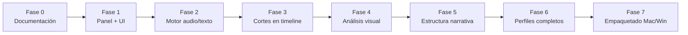

# 07 · Roadmap y fases

Construcción por hitos, del más básico al más completo. Cada fase entrega algo **probable** en tu Premiere.

## Fase 0 — Documentación ✅ (actual)
- Visión, arquitectura, perfiles, UX, transcripción, instalación.
- **Entregable:** este set de documentos.
- **Cierre:** tu aprobación del diseño.

## Fase 1 — Panel UXP + interfaz
- Proyecto UXP base con `manifest.json` para Premiere 26.3.2.
- UI: elegir carpeta, tipo de video, idioma, modo transcripción, botón Iniciar.
- Se carga en Premiere vía UXP Developer Tool.
- **Entregable:** panel visible y navegable (aún sin procesar).
- **Cómo lo pruebas:** lo cargas en tu Premiere y ves la interfaz.

## Fase 2 — Motor de análisis
- Lectura de la carpeta + extracción de audio (FFmpeg).
- Transcripción local **y** por API (elegible).
- Análisis IA con un primer perfil.
- Genera el JSON de cortes (aún sin tocar el timeline).
- **Entregable:** de una carpeta → archivo de cortes correcto.
- **Cómo lo pruebas:** ves el JSON de cortes y la lista en el panel.

## Fase 3 — Construcción de cortes en el timeline
- Con `@adobe/premierepro`: importar clips + crear secuencia + insertar cortes.
- Paso de "Revisar cortes" (aprobar antes de construir).
- **Entregable:** de carpeta → secuencia editada en Premiere. 🎉
- **Cómo lo pruebas:** flujo completo end-to-end con material real.

## Fase 4 — Análisis visual (frame a frame)
- FFmpeg: detección de escenas + muestreo de frames.
- Modelo de visión (local/API) puntúa cada frame (cara, nitidez, texto, energía).
- Fusión de score audio + visión → cortes más limpios y mejor gancho visual.
- **Entregable:** cortes mejorados con criterio visual; elección del mejor frame de apertura.
- Detalle: [09 · Análisis visual](./09-analisis-visual.md).

## Fase 5 — Estructura narrativa (Hook → Gancho → Cuerpo → CTA)
- Clasificador de rol por segmento según el perfil.
- Montaje ordenado por estructura + marcadores de sección en el timeline.
- **Entregable:** secuencia estructurada con marcadores 🔴🟠🟢🔵.
- Detalle: [10 · Estructura narrativa](./10-estructura-narrativa.md).

## Fase 6 — Perfiles completos + señales de audio
- Todos los perfiles (reel, política, deporte, ecommerce, entrevista).
- Silencios + picos de volumen integrados al scoring.
- Pesos audio/visión por perfil + opciones avanzadas (duración objetivo, umbrales).
- **Entregable:** resultados afinados por tipo de contenido.

## Fase 7 — Empaquetado e instalación
- Empaquetar `.ccx` para macOS y Windows.
- Scripts de setup del motor local por SO.
- Guía de instalación final + solución de problemas.
- **Entregable:** instalable de doble clic en ambos sistemas.

## Mejoras futuras (post-v1, ideas)
- Reconocimiento de escenas visuales (no solo audio).
- Detección de caras / hablantes (diarización).
- Plantillas de exportación directa a redes.
- Subtítulos automáticos incrustados.
- Aprender de tus ediciones (ajustar el scoring a tu estilo).

## Nota importante sobre pruebas
Yo puedo **construir y entregar** todo el código aquí, pero **Premiere corre en tu Mac/Windows**, no en este entorno. Por eso cada fase está diseñada para que **tú la pruebes** y ajustemos con lo que veas en pantalla. Es un desarrollo **colaborativo e iterativo**.
