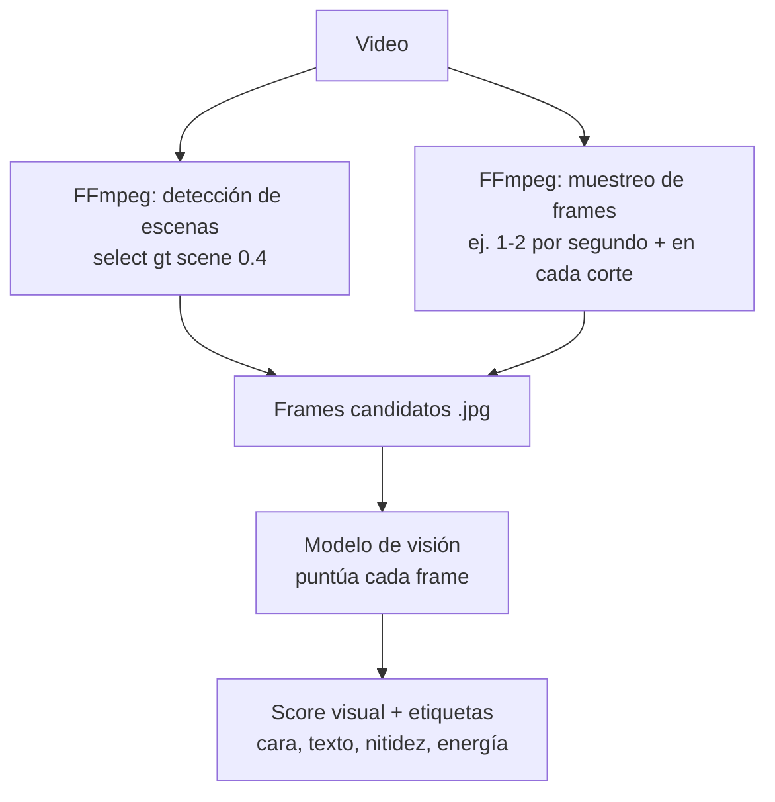
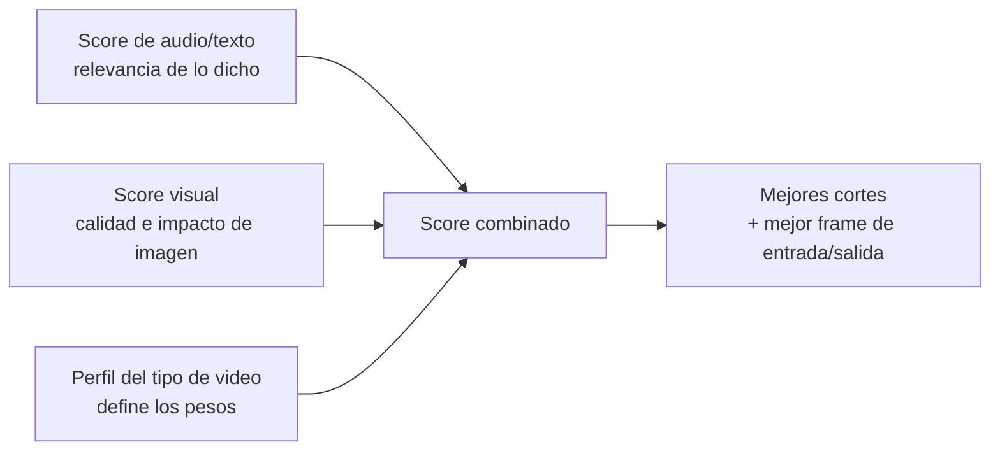

# 09 · Análisis visual (frame a frame)

Hasta ahora los cortes se decidían por **audio + texto**. Este documento añade el **ojo** de la herramienta: analizar la **imagen**, frame a frame, para elegir mejores cortes, el mejor **gancho visual** y estructurar el video.

## Por qué análisis visual

El audio dice *qué se dice*; la imagen dice *qué se ve*. Muchos aciertos de edición son puramente visuales:
- El **primer frame** que engancha (un rostro, un movimiento, un producto).
- Cortar donde hay **cambio de plano** (no a mitad de un movimiento).
- Evitar frames **borrosos, oscuros o con ojos cerrados**.
- Detectar **texto en pantalla**, **caras**, **acción/movimiento**.

## ¿Cómo se "ven" los videos? Dos caminos

### Camino A — FFmpeg + modelo de visión (recomendado, a escala)
El motor externo extrae frames y los analiza con un **modelo multimodal (visión)**.

- **Detección de escenas:** FFmpeg marca dónde cambia el plano → cortes naturales.
- **Muestreo:** 1–2 frames/seg (y frames en los bordes de cada segmento candidato).
- **Visión:** cada frame recibe un **score visual** + etiquetas (cara, sonrisa, texto, nitidez, movimiento, composición). Local o por API, igual que la transcripción.

### Camino B — `exportFramePng` de Premiere (nativo, puntual)
Premiere (UXP) puede exportar un frame concreto a PNG (`exportFramePng`). Útil para **thumbnails** o para renderizar el frame exacto de un corte ya decidido, pero **no** para escanear miles de frames (sería lento). Se usa como complemento, no como motor principal.

> **Decisión:** motor principal = **FFmpeg + visión** (Camino A). `exportFramePng` = complemento para previews/thumbnails (Camino B).

## Qué mide el análisis visual (por frame o por plano)

| Señal | Para qué sirve |
|-------|----------------|
| **Nitidez / enfoque** | Descartar frames borrosos como punto de corte |
| **Brillo / exposición** | Evitar frames muy oscuros/quemados |
| **Caras y expresión** | Priorizar planos con rostro/mirada/sonrisa (enganchan) |
| **Movimiento / energía** | Detectar acción (clave en deporte/reels) |
| **Texto en pantalla (OCR)** | Reconocer rótulos, precios, CTAs visuales |
| **Composición** | Preferir encuadres limpios para hooks/portadas |
| **Cambio de plano (escena)** | Cortar en límites naturales, no a media acción |

## Cómo se combinan audio + visión

El puntaje final de cada segmento mezcla ambas señales, con pesos que dependen del **perfil del tipo de video**:

Ejemplos de peso por perfil:
- **Reel / Ecommerce:** visión pesa **alto** (lo visual vende).
- **Política / Entrevista:** audio/texto pesa **alto** (importa lo que se dice).
- **Deporte:** visión + picos de audio pesan **alto** (la acción).

## Mejora concreta de los cortes gracias a la visión

1. **Ajuste fino del punto de corte:** si el audio sugiere cortar en el segundo 12.4 pero ahí hay un frame borroso o a mitad de un gesto, la visión desplaza el corte al frame limpio más cercano (ej. 12.2 o 12.6).
2. **Elección del mejor gancho visual:** entre varios inicios posibles, elige el frame de apertura con más impacto (cara, movimiento, color, texto).
3. **Evitar planos malos:** descarta segmentos con imagen defectuosa aunque el audio sea bueno.
4. **Respetar límites de plano:** corta en cambios de escena para que no se sienta "brusco".

## Coste y rendimiento

| Enfoque | Coste | Velocidad |
|---------|-------|-----------|
| Detección de escenas (FFmpeg) | Gratis | Rápido |
| Visión local (modelo abierto) | Gratis | Depende del hardware |
| Visión por API (multimodal) | Por imagen/token | Rápido |

**Optimización:** no se analizan *todos* los frames. Se analizan (a) los **bordes de cada segmento candidato** y (b) un **muestreo** dentro de cada plano. Esto reduce el coste enormemente sin perder calidad de decisión.

> Ver cómo esto alimenta la estructura **Hook → Gancho → Cuerpo → CTA** en [10 · Estructura narrativa](./10-estructura-narrativa.md).
