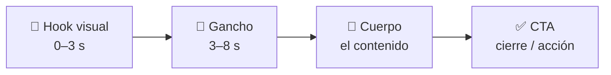
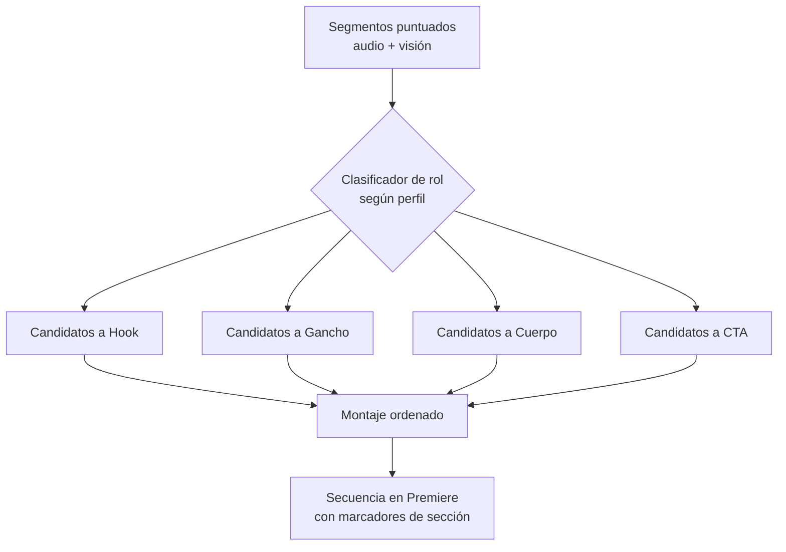

# 10 · Estructura narrativa: Hook → Gancho → Cuerpo → CTA

Además de elegir buenos cortes, CorteIA **organiza** el video en una estructura que retiene y convierte. Especialmente útil para reels, ecommerce y social.

## Las 4 partes



| Parte | Objetivo | Cómo la detecta CorteIA |
|-------|----------|--------------------------|
| **🎣 Hook visual** | Frenar el scroll en los primeros segundos | Mejor **frame de apertura** (visión) + primer segmento de alta energía (audio) |
| **🧲 Gancho** | Prometer valor / crear curiosidad | Frase de promesa o pregunta (texto) apoyada por imagen fuerte |
| **📖 Cuerpo** | Entregar el contenido/mensaje | Segmentos con mayor score de relevancia según el perfil |
| **✅ CTA** | Llamado a la acción / cierre | Frase de cierre o llamado ("suscríbete", "compra", "link abajo") + texto en pantalla |

> Nota: **"Hook visual"** = el impacto de imagen inicial. **"Gancho"** = la promesa verbal/conceptual que sigue. Se distinguen a propósito: uno frena el scroll, el otro convence de quedarse.

## Cómo se arma la estructura



1. Cada segmento ya tiene score de **audio** y **visión**.
2. Un paso de IA **clasifica el rol** de cada segmento (hook/gancho/cuerpo/CTA) usando el `scoringPrompt` del perfil.
3. Se **selecciona el mejor** de cada rol (el hook con mejor frame de apertura, el CTA más claro, etc.).
4. Se **ordena** el montaje: hook primero, CTA al final, cuerpo en medio con ritmo del perfil.
5. En Premiere se añaden **marcadores de sección** (Hook / Gancho / Cuerpo / CTA) para que sepas qué es cada bloque y lo ajustes fácil.

## Ejemplo de salida (JSON de cortes con roles)

```json
{
  "sequenceName": "CorteIA - Reel - 2026-08-19",
  "profile": "reel",
  "structure": "hook-gancho-cuerpo-cta",
  "sections": [
    {
      "role": "hook",
      "clip": "toma01.mp4", "in": 12.2, "out": 14.0,
      "audioScore": 0.71, "visualScore": 0.94,
      "reason": "frame de apertura con rostro y movimiento; corta el scroll"
    },
    {
      "role": "gancho",
      "clip": "toma01.mp4", "in": 14.0, "out": 18.5,
      "audioScore": 0.88, "visualScore": 0.66,
      "reason": "promesa clara: 'te muestro cómo en 2 minutos'"
    },
    {
      "role": "cuerpo",
      "clip": "toma02.mp4", "in": 3.5, "out": 22.0,
      "audioScore": 0.83, "visualScore": 0.72,
      "reason": "explicación central del contenido"
    },
    {
      "role": "cta",
      "clip": "toma03.mp4", "in": 40.0, "out": 45.0,
      "audioScore": 0.79, "visualScore": 0.81,
      "reason": "llamado a la acción + texto en pantalla 'link abajo'"
    }
  ]
}
```

## Cómo cada perfil usa la estructura

| Perfil | Estructura |
|--------|-----------|
| **Reel / Social** | Estructura completa, hook agresivo, CTA obligatorio |
| **Ecommerce** | Hook (producto) → beneficios (cuerpo) → CTA de compra |
| **Deporte** | Hook = mejor jugada; cuerpo = secuencia de acción; CTA opcional |
| **Política** | Hook = declaración fuerte; cuerpo = argumento; sin CTA comercial |
| **Entrevista** | Hook = mejor frase; cuerpo = conversación; cierre reflexivo |

> Los perfiles pueden **activar o desactivar** la estructura. Un documental largo quizá no quiera CTA; un reel siempre sí.

## En el timeline

Al terminar, la secuencia trae **marcadores de color por sección**:
- 🔴 Hook · 🟠 Gancho · 🟢 Cuerpo · 🔵 CTA

Así ves de un vistazo la anatomía del video y reordenas/ajustas con un clic.
