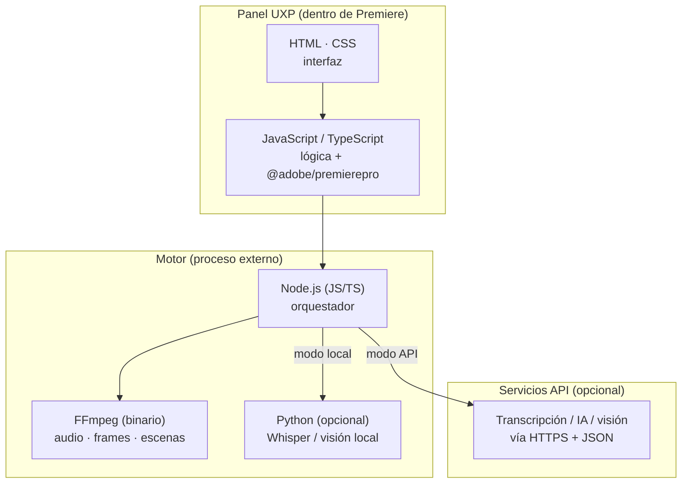

# 13 · Lenguajes de programación y stack técnico

## Respuesta directa

| ¿Se usa? | Lenguaje / tecnología | Para qué |
|----------|----------------------|----------|
| ✅ **Sí** | **HTML** | Estructura de la interfaz del panel |
| ✅ **Sí** | **CSS** | Estilos del panel (componentes Spectrum `sp-*`) |
| ✅ **Sí** | **JavaScript / TypeScript** | Lógica del panel y control de Premiere (`@adobe/premierepro`) |
| ✅ **Sí** | **Node.js** (JS/TS) | Motor: orquesta FFmpeg, transcripción, IA |
| ⚙️ **Opcional** | **Python** | Solo si se usa IA **local** (Whisper, visión) |
| ⚙️ **Binario** | **FFmpeg** (C/C++, precompilado) | Extraer audio, frames, detectar escenas |
| ❌ **No** | ~~Java~~ | No aplica al ecosistema de plugins de Adobe |
| ❌ **No** | ~~PHP~~ | No aplica (no hay servidor web tradicional) |

## Por qué estos lenguajes

Los plugins de Premiere 2026 se construyen con **UXP**, que corre **tecnologías web**. Por eso el panel es **HTML + CSS + JavaScript** (igual que una página web, pero dentro de Premiere). **TypeScript** es JavaScript con tipos: lo usamos porque el paquete oficial `@adobe/premierepro` trae tipos y evita errores.

**Java** y **PHP** pertenecen a otros mundos (apps de escritorio Android/empresa y servidores web) y **no** encajan en la extensibilidad de Adobe.

## El stack por capas

## Detalle por componente

### 1. Panel (UI) — HTML · CSS · JS/TS
- **HTML:** los campos (carpeta, duración, formato, tipo…), botones, barra de progreso.
- **CSS:** apariencia; se usan componentes **Spectrum** de Adobe (`sp-button`, `sp-dropdown`, etc.) para que se vea nativo.
- **JS/TS:** responde a los clics y llama a la API de Premiere para crear la secuencia e insertar cortes.

### 2. Puente con Premiere — `@adobe/premierepro`
- Paquete oficial (npm) en **JS/TS**. Crea secuencias, importa clips, inserta cortes, pone marcadores. Todo **asíncrono**.

### 3. Motor de análisis — Node.js (+ Python opcional)
- **Node.js** coordina todo: lanza FFmpeg, gestiona transcripción y análisis, arma el JSON de cortes.
- **FFmpeg** (binario, sin programar): extrae audio y frames, detecta escenas y silencios.
- **Python (opcional):** solo para IA **local** —`faster-whisper` (transcripción) o modelos de visión—, porque el ecosistema de IA vive en Python.
  - *Alternativa sin Python:* **whisper.cpp** (binario C++) evita instalar Python para transcripción local.

### 4. Servicios API (opcional)
- Si eliges modo API, el motor hace llamadas **HTTPS con JSON** a servicios de transcripción / IA / visión. No requiere lenguaje adicional.

## Herramientas de desarrollo

| Herramienta | Uso |
|-------------|-----|
| **UXP Developer Tool (UDT)** | Cargar y probar el panel en Premiere |
| **Node.js + npm** | Instalar dependencias y compilar TypeScript |
| **VS Code** | Editor recomendado |
| **Git** | Control de versiones del proyecto |

## Resumen en una frase

> El corazón es **JavaScript/TypeScript** (panel + motor con Node.js), con **HTML/CSS** para la interfaz y **FFmpeg**; **Python** entra solo si quieres IA local. **Nada de Java ni PHP.**
