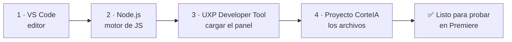

# 14 · Guía paso a paso con VS Code (para no-programadores)

Esta guía asume que **nunca has programado**. Cada paso está explicado en simple. No tienes que entender el código: solo instalar unas herramientas, copiar-pegar comandos y hacer clic.

> 💡 Idea clave: el **código lo escribo yo**. Tú solo preparas tu computadora y ejecutas lo que te indico. VS Code es como "Word para código": un programa donde se abre el proyecto.

## Qué vas a instalar (una sola vez)



| # | Herramienta | Para qué | Dónde |
|---|-------------|----------|-------|
| 1 | **Visual Studio Code** | Abrir y ver el proyecto | code.visualstudio.com |
| 2 | **Node.js (versión LTS)** | Instalar librerías y compilar | nodejs.org |
| 3 | **UXP Developer Tool** | Meter el panel en Premiere | App de Creative Cloud → Marketplace |
| 4 | **El proyecto CorteIA** | Los archivos del plugin | Te lo entrego yo (carpeta/ZIP) |

---

## Paso 1 · Instalar Visual Studio Code

1. Entra a **code.visualstudio.com**.
2. Descarga la versión para tu sistema (**macOS** o **Windows**).
3. Instálalo como cualquier programa (siguiente → siguiente → finalizar).
4. Ábrelo una vez para confirmar que funciona.

> **¿Qué es?** Un editor de texto para código. Aquí abriremos la carpeta del proyecto.

## Paso 2 · Instalar Node.js

1. Entra a **nodejs.org**.
2. Descarga la versión **LTS** (la recomendada, botón de la izquierda).
3. Instálala (siguiente → siguiente → finalizar).
4. Para comprobar que quedó bien: abre VS Code → menú **Terminal → New Terminal** y escribe:
   ```bash
   node --version
   ```
   Si aparece algo como `v22.x.x`, ¡funciona! ✅

> **¿Qué es?** El "motor" que ejecuta JavaScript fuera del navegador. Necesario para instalar librerías y compilar el panel.

## Paso 3 · Instalar UXP Developer Tool (UDT)

1. Abre la app de **Adobe Creative Cloud** (la que usas para instalar Premiere).
2. Busca **"UXP Developer Tool"** (en Marketplace / Escritorio) e instálala. Es **gratis**.
3. Ábrela. Aquí es donde "cargaremos" el panel dentro de Premiere.

> **¿Qué es?** La herramienta oficial de Adobe para probar plugins mientras se desarrollan, sin tener que empaquetarlos.

## Paso 4 · Abrir el proyecto en VS Code

1. Descomprime el ZIP del proyecto que te entrego (ej. `CorteIA/`).
2. En VS Code: menú **File → Open Folder…** y elige la carpeta del proyecto.
3. Verás a la izquierda la lista de archivos. **No toques nada**: solo vamos a ejecutar comandos.

## Paso 5 · Instalar las librerías del proyecto

Las "librerías" son piezas de código ya hechas que el proyecto necesita (ej. `@adobe/premierepro`). Se instalan solas con **un comando**.

1. En VS Code abre **Terminal → New Terminal**.
2. Escribe exactamente:
   ```bash
   npm install
   ```
3. Pulsa Enter y **espera** (puede tardar 1–3 min). Se creará una carpeta `node_modules` con todo lo necesario.

> **¿Qué hizo `npm install`?** Leyó el archivo `package.json` (la "lista de compras" del proyecto) y descargó todas las librerías automáticamente. **No instalas nada a mano.**

## Paso 6 · Compilar el panel (si usa TypeScript)

Algunos proyectos necesitan "compilar" (traducir TypeScript a JavaScript). Si aplica, será otro comando simple:
```bash
npm run build
```
> Yo te diré si tu versión lo necesita y cuándo.

## Paso 7 · Cargar el panel en Premiere

1. Abre **Premiere Pro 26.3.2**.
2. Abre **UXP Developer Tool**.
3. Clic en **Add Plugin** → selecciona el archivo **`manifest.json`** dentro de la carpeta del proyecto.
4. Clic en **Load**. El panel **CorteIA** aparecerá en Premiere (menú **Ventana → Extensiones**).
5. (Opcional) Clic en **Watch**: cada cambio que yo haga se recarga solo.

✅ ¡Listo! Ya tienes el panel corriendo para probar.

---

## Comandos que usarás (chuleta)

| Comando | Qué hace |
|---------|----------|
| `node --version` | Comprueba que Node está instalado |
| `npm install` | Descarga las librerías del proyecto |
| `npm run build` | Compila el panel (si aplica) |
| `npm run dev` / `watch` | Modo desarrollo con recarga (si aplica) |

> **Regla de oro:** copia y pega **exactamente** lo que te doy. Si algo falla, **copia el texto rojo del error y pégamelo**: yo lo interpreto y te doy el arreglo.

## Problemas comunes

| Síntoma | Solución |
|---------|----------|
| `node no se reconoce / command not found` | Reinstala Node.js y reinicia VS Code |
| `npm install` da errores rojos | Copia el error y envíamelo; suele ser permisos o red |
| El panel no aparece en Premiere | Verifica que elegiste el `manifest.json` correcto y que Premiere es 26+ |
| "Permission denied" | En Mac, dar permisos; en Windows, ejecutar como administrador |

## Lo que NO necesitas hacer
- ❌ No necesitas escribir código.
- ❌ No necesitas entender JavaScript/TypeScript.
- ❌ No necesitas configurar nada complejo a mano.
- ✅ Solo: instalar las 3 herramientas, abrir la carpeta, correr `npm install` y cargar el panel.

> Ver el modelo de colaboración (cómo lo hacemos juntos) en [15 · Cómo trabajamos juntos](./15-como-trabajamos-juntos.md).
