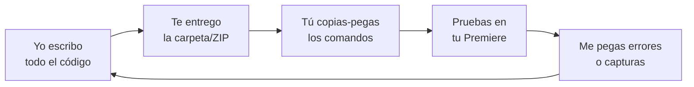

# 15 · Cómo trabajamos juntos (sin que programes)

Este documento responde a una pregunta clave: **"Yo no sé programar, ¿puedes acceder a mi PC y hacerlo todo?"**

## Respuesta honesta sobre el acceso a tu PC

**No tengo la capacidad de "tomar control remoto" de tu computadora** como lo haría un software de escritorio remoto (tipo TeamViewer/AnyDesk). No puedo mover tu mouse ni instalar cosas por mi cuenta en tu máquina.

**Pero eso no es un problema**, porque la forma de trabajar hace que **tú nunca tengas que programar**. Yo escribo el 100% del código; tú solo haces clics y copias-pegas lo que te indico.

## Cómo colaboramos en la práctica

1. **Yo programo** — escribo todos los archivos del plugin (panel, motor, perfiles).
2. **Te los entrego** — como carpeta o ZIP descargable, listos.
3. **Tú los ejecutas** — sigues la [guía paso a paso](./14-guia-vscode-paso-a-paso.md): instalar 3 herramientas, `npm install`, cargar el panel.
4. **Pruebas** — abres el panel en Premiere y lo usas con material real.
5. **Me cuentas** — si algo falla, **me pegas el texto del error o una captura**; yo lo interpreto y te doy el arreglo.
6. **Repetimos** — iteramos hasta que quede perfecto.

> Tú eres mis "ojos y manos" en tu Premiere; yo soy el cerebro que programa. Con eso basta.

## ¿Hay alguna forma de que trabajes más directo en mi máquina?

Sí, dependiendo de tu configuración, hay opciones que **reducen aún más** lo que tienes que hacer:

| Opción | Qué implica |
|--------|-------------|
| **Craft Agent en tu equipo** | Si usas Craft Agent instalado en tu Mac/Windows y defines una **carpeta de trabajo** local, el agente puede **escribir los archivos directamente ahí**. Tú solo cargas el panel en Premiere. |
| **Comandos guiados** | Te doy comandos "de un solo clic" (scripts) que instalan y configuran todo automáticamente. |
| **Instaladores** | En la fase final, te entrego un archivo `.ccx` que se instala con **doble clic** (sin terminal). |
| **Sesión en vivo** | Tú compartes pantalla (por tu cuenta) y yo te guío en tiempo real, paso a paso. |

> **Importante:** aunque el agente escriba archivos, **Premiere corre en tu máquina**. La prueba final del panel siempre ocurre en tu Premiere; por eso tu rol de "probar y reportar" es esencial.

## Lo que necesito de ti (mínimo)

- ✅ Instalar 3 programas una vez (VS Code, Node.js, UXP Developer Tool).
- ✅ Copiar-pegar los comandos que te doy.
- ✅ Probar el panel en tu Premiere.
- ✅ Enviarme errores/capturas cuando algo no funcione.

## Lo que yo pongo

- ✅ Todo el código (panel + motor + perfiles).
- ✅ Las guías paso a paso.
- ✅ La interpretación de errores y los arreglos.
- ✅ Los scripts/instaladores para simplificarte la vida.

## Seguridad y confianza

- Nunca te pediré contraseñas ni control remoto de tu equipo.
- Los comandos que te dé son estándar y públicos (`npm install`, etc.); si tienes dudas, me preguntas qué hace cada uno antes de ejecutarlo.
- Tus videos y datos se quedan en **tu** computadora (salvo que elijas el modo API, donde el audio se procesa en un servicio externo — ver [05 · Transcripción](./05-transcripcion-y-analisis.md)).

## Resumen

> No puedo controlar tu PC a distancia, **pero no lo necesito**: yo hago la programación y te la entrego lista; tú solo instalas, ejecutas comandos simples y pruebas. Es un trabajo en equipo donde **no escribes ni una línea de código**.
